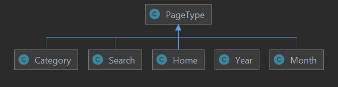

# Search And Layered Navigation

Readers of [osm.software](https://osm.software/blog/) blog can search the blog for a specific phrase, and narrow down listed articles using multi-select layered navigation. Let's see how it works under the hood.

{{ toc }}

### meta.list_text

Readers of *osm.software* blog can search the blog for a specific phrase, and
narrow down listed articles using multi-select layered navigation. Let's see how
it works under the hood.

## Filters

A **filter** is a part of a page that when applied, narrows the selection of displayed blog posts. 

Most filters are displayed in the left sidebar. Currently, there are category and date filters, but you can add more:

One exception. The search filter is displayed in the page header:

### Defining Filters

Define available filters in the [`Posts::$filters`](https://github.com/osmphp/osmsoftware-website/blob/HEAD/src/Posts/Posts.php) property getter:

    protected function get_filters(): array {
        return [
            'q' => Filter\Search::new([
                'name' => 'q',
                'collection' => $this, 
            ]),
            'category' => Filter\Category::new([
                'name' => 'category',
                'collection' => $this,
            ]),
            'date' => Filter\Date::new([
                'name' => 'date',
                'collection' => $this,
            ]),
        ];
    }

All three filters extend [`Filter`](https://github.com/osmphp/osmsoftware-website/blob/HEAD/src/Posts/Filter.php) class.

### Rendering Filters

Page Blade templates, for example [`all.blade.php`](https://github.com/osmphp/osmsoftware-website/blob/HEAD/themes/_front__tailwind/views/posts/pages/all.blade.php), render filters in the sidebar using the following code snippet:

    @foreach ($posts->filters as $filter)
        @if ($filter->visible)
            <x-dynamic-component :component="$filter->component"
                :filter="$filter" />
        @endif
    @endforeach
 
`$filter->visible` is always `false` for the search filter, and it's never displayed in the sidebar. For the category and date filters, `visible` is true unless the underlying search query returns no facet counts. 

### Filter Blade Components And Templates

`$filter->component` handles actual rendering. It returns a [Blade component](https://laravel.com/docs/blade#components), for example, [`Filter\Category`](https://github.com/osmphp/osmsoftware-website/blob/HEAD/src/Posts/Filter/Category.php) returns `posts::filter.category`.

The Blade component is a pair of PHP object containing data to be displayed, and the template. For example, `posts::filter.category` component name resolves to the [`Components\Front\Filter\Category`](https://github.com/osmphp/osmsoftware-website/blob/HEAD/src/Posts/Components/Front/Filter/Category.php) component class, and the [`posts::components.filter.category`](https://github.com/osmphp/osmsoftware-website/blob/HEAD/themes/_front__tailwind/views/posts/components/filter/category.blade.php) Blade template.   

The Blade template of a filter renders filter items. For example, the [`posts::components.filter.category`](https://github.com/osmphp/osmsoftware-website/blob/HEAD/themes/_front__tailwind/views/posts/components/filter/category.blade.php) template renders them as follows:

    ...
    <h2 class="text-xl font-bold mt-8 mb-4">{!! $filter->title_html !!}</h2>
    <ul>
        @foreach($filter->items as $item)
            @if ($item->visible)
                <li>
                    ...
                </li>
            @endif
        @endforeach
    </ul>

The result:

### Filter Items

Filter items are PHP objects constructed from the search query result. For example, [`Filter\Category`](https://github.com/osmphp/osmsoftware-website/blob/HEAD/src/Posts/Filter/Category.php) constructs them as follows:

    protected function get_items(): array {
        $items = [];

        foreach ($this->facet->counts as $facetItem) {
            $item = FilterItem\Category::new([
                'filter' => $this,
                'value' => $facetItem->value,
                'count' => $facetItem->count,
            ]);

            if ($item->category) {
                $items[] = $item;
            }
        }

        usort($items, fn(FilterItem\Category $a, FilterItem\Category $b)
            => $a->category->sort_order <=> $b->category->sort_order);
        return $items;
    }

### Rendering Search Form

As already mentioned, the search filter is not rendered in the sidebar using a Blade component. Instead, it is rendered in the page header template, [`posts::components.header`](https://github.com/osmphp/osmsoftware-website/blob/HEAD/themes/_front__tailwind/views/posts/components/header.blade.php):

    ...
    <ul class="flex px-4 mb-4 bg-white">
        ...
        <li class="w-32 h-10 flex-grow flex items-center">
            <form action="{{ "{$osm_app->http->base_url}/blog/search" }}" class="flex-grow">
                

                    <button aria-label="{{ \Osm\__("Search") }}" type="submit"
                        class="w-6 h-6 mr-2 flex items-center justify-center
                            focus:outline-none"
                    >
                        <i class="fas fa-search"></i>
                    </button>
                    <input type="text" name="q"
                        placeholder="{{ \Osm\__("Search blog") }}"
                        class="w-20 flex-grow focus:outline-none"
                        value="{{ $osm_app->http->query['q'] ?? '' }}">
                

            </form>
        </li>
        ...
    </ul>

The result:

## Applied Filters

When a reader marks a filter item as checked in the sidebar, or submits a search phrase into the search form in the page header, she *applies the filter*, and the browser loads a page with that filter applied. All applied filters appear in the page URL.

### URL Structure

All URLs have the same structure. For example, let's examine <https://osm.software/blog/search?q=framework&category=framework+osmsoftware&date=2021-05+2021-07#page2> URL:

* `https://` is the *protocol*
* `osm.software` is the *domain*
* `/blog/search` is the *path* 
* `?q=framework&category=framework+osmsoftware&date=2021-05+2021-07` is the *query*
* `#page2` is the *hash*

### Parsing URL Query Parameters

Most of the time, applied filters appear in the URL query. Continuing with the previous example:

* `q=framework` means that the reader entered "framework" search phrase.
* `category=framework+osmsoftware` means that the reader have chosen "Osm Framework" and "osm.software Website" categories (their URL keys are `framework` and `osmsoftware`, accordingly).
* `date=2021-05+2021-07` means that the reader have picked May and July from the date filter.

Each filter object parses its own part of the URL query. For example, [`Filter\Category`](https://github.com/osmphp/osmsoftware-website/blob/HEAD/src/Posts/Filter/Category.php) splits the URL parameter by the space character (the equivalent of `+` URL character), and for every valid category URL key creates an applied filter object:

    protected function get_applied_filters(): array {
        ...
        $appliedFilters = [];

        if (!$this->unparsed_value) {
            return $appliedFilters;
        }

        foreach (explode(' ', $this->unparsed_value) as $urlKey) {
            if (isset($this->category_module->categories[$urlKey])) {
                $appliedFilters[$urlKey] = AppliedFilter\Category::new([
                    'category' => $this->category_module->categories[$urlKey],
                    'filter' => $this,
                ]);
            }
        }

        return array_values($appliedFilters);
    }

### Getting All Applied Filters

The `applied_filters` property of the [`Posts`](https://github.com/osmphp/osmsoftware-website/blob/HEAD/src/Posts/Posts.php) collection object merges all applied filters into a single array: 

    protected function get_applied_filters(): array {
        $appliedFilters = [];

        foreach ($this->filters as $filter) {
            $appliedFilters = array_merge($appliedFilters,
                $filter->applied_filters);
        }

        return $appliedFilters;
    }

### Rendering Applied Filters

Page Blade templates, for example [`all.blade.php`](https://github.com/osmphp/osmsoftware-website/blob/HEAD/themes/_front__tailwind/views/posts/pages/all.blade.php), render applied filters in the sidebar using the following code snippet:

    <x-posts::applied_filters :posts="$posts"/>

The underlying Blade component, [`Components\Front\AppliedFilters`](https://github.com/osmphp/osmsoftware-website/blob/HEAD/src/Posts/Components/Front/AppliedFilters.php), and its template, [`posts::components.applied-filters`](https://github.com/osmphp/osmsoftware-website/blob/HEAD/themes/_front__tailwind/views/posts/components/applied-filters.blade.php), render all applied filters as follows:

    ...
    @if (count($posts->applied_filters))
        <h2 class="text-xl font-bold mt-8 mb-4">
            {{ \Osm\__("Applied Filters") }}
        </h2>
        <ul class="flex flex-wrap">
            @foreach ($posts->applied_filters as $appliedFilter)
                <li class="mr-4">
                    ...
                </li>
            @endforeach
        </ul>
        

            <a href="{{ $posts->url()->removeAllFilters() }}"
                title="{{ \Osm\__("Clear all") }}" class="link"
            >
                {{ \Osm\__("Clear all") }}</a>
        

    @endif

The result:

### Putting Applied Filters Into URL Path

For SEO purposes, certain applied filters are putting into the URL path instead of the URL query:

* if there is only one applied category filter, then the generated URL is <https://osm.software/blog/framework/?q=framework&date=2021-05+2021-07> rather than <https://osm.software/blog/search?q=framework&date=2021-05+2021-07&category=framework>;

* otherwise, if there is only one applied date filter, then the generated URL is <https://osm.software/blog/2021/05/?q=framework&category=framework+osmsoftware> rather than <https://osm.software/blog/search?q=framework&category=framework+osmsoftware&date=2021-05>

It's good for 3 reasons:

1. Category URL key appears closer to the beginning of the URL, and, hence, ranks higher.

2. Every category, year and month get a dedicated page template, and the specific content tailored at that specific category or date period. For example, category pages display category descriptions.

3. From the outside, the blog seems to have clear hierarchical directory structure:

        https://osm.software/blog/
            framework/
                ...
            osmsoftware/
                ...
            2021/
                05/
                    ...
                06/
                    ...
                07/
                    ...        

### Dedicated Routes

All blog routes, including those for category, year and month pages are handled by the [`Dynamic`](https://github.com/osmphp/osmsoftware-website/blob/HEAD/src/Posts/Routes/Front/Dynamic.php) route. 

Under the hood, it uses [`nikic/fast-route`](https://github.com/nikic/FastRoute) package to recognize the following routes:

    protected function collectRoutes(RouteCollector $r): void {
        $r->get('', AddTrailingSlash::class);
        $r->get('/{year:\d+}', AddTrailingSlash::class);
        $r->get('/{year:\d+}/{month:\d+}', AddTrailingSlash::class);
        $r->get('/{category:(?!search)\w[^/]*}', AddTrailingSlash::class);

        $r->get('/', RenderAllPosts::class);
        $r->get('/search', RenderSearchResults::class);
        $r->get('/{year:\d+}/{month:\d+}/{url_key}.html',
            RenderPost::class);
        $r->get('/{year:\d+}/', RenderYearPosts::class);
        $r->get('/{year:\d+}/{month:\d+}/', RenderMonthPosts::class);
        $r->get('/{category:\w[^/]*}/', RenderCategoryPosts::class);
        $r->get('/{image_path:.*\.(?:jpg|gif|png)}', RenderImage::class);
    }

If the incoming route matches the regular expression, then specified route class is called to handle the request. For example, `/framework` URL matches `/{category:\w[^/]*}/` regular expression, and [`RenderCategoryPosts`](https://github.com/osmphp/osmsoftware-website/blob/HEAD/src/Posts/Routes/Front/RenderCategoryPosts.php) is called to render the category page. In addition, fetched `category` regular expression group is passed to the [`RenderCategoryPosts`](https://github.com/osmphp/osmsoftware-website/blob/HEAD/src/Posts/Routes/Front/RenderCategoryPosts.php) route constructor.

The route does two things. It creates a [`PageType`](https://github.com/osmphp/osmsoftware-website/blob/HEAD/src/Posts/PageType.php) object, so that the filtering engine can apply a filter from the URL path, and renders a dedicated template:

    public function run(): Response {
        $pageType = PageType\Category::new([
            'category_url_key' => $this->category,
        ]);

        if (!$pageType->category) {
            throw new NotFound();
        }

        return view_response('posts::pages.category', [
            'posts' => Posts::new(['page_type' => $pageType]),
        ]);
    }

### Page Types

Every route with filters passed its own [`PageType`](https://github.com/osmphp/osmsoftware-website/blob/HEAD/src/Posts/PageType.php) to the [`Posts`](https://github.com/osmphp/osmsoftware-website/blob/HEAD/src/Posts/Posts.php) collection object:

 

The page type object tells the collection object to ignore certain URL query parameter, and use specified value from the URL path. For example, given the category page type, the collection ignores `category` URL query parameter, and uses page type's `category` property.

It happens in the `get_applied_filters()` of every [`Filter`](https://github.com/osmphp/osmsoftware-website/blob/HEAD/src/Posts/Filter.php) object. For example, category filter has a special `if` clause just for page type:

    protected function get_applied_filters(): array {
        if ($this->collection->page_type->category) {
            return [AppliedFilter\Category::new([
                'category' => $this->collection->page_type->category,
                'filter' => $this,
            ])];
        }

        ...
    } 

## Generating Filtered URLs

### Using `Url` Class

Most filtered URLs are generated using [`Url`](https://github.com/osmphp/osmsoftware-website/blob/HEAD/src/Posts/Url.php) class. This class knows how to render applied value for every filter, how to combine multiple items of them same filter, when to put the applied filter into the URL path instead of the URL query, and other little, but important details. 

To use the [`Url`](https://github.com/osmphp/osmsoftware-website/blob/HEAD/src/Posts/Url.php) class, instantiate it with some initial set of applied filters, use its method to add/remove applied filters, and, finally, convert it to string. 

For example, consider category filter template, [`posts::components.filter.category`](https://github.com/osmphp/osmsoftware-website/blob/HEAD/themes/_front__tailwind/views/posts/components/filter/category.blade.php). It renders every filter item URL as follows:

    <a href="{{ $item->applied ? $item->remove_url : $item->add_url }}" ...>

`add_url` and `remote_url` properties of the [`FilterItem\Category`](https://github.com/osmphp/osmsoftware-website/blob/HEAD/src/Posts/FilterItem/Category.php) class take the current URL, and add/remove the items from it:

    protected function get_add_url(): string|Url {
        return $this->filter->collection->url()
            ->addCategoryFilter($this->category);
    }

    protected function get_remove_url(): string|Url {
        return $this->filter->collection->url()
            ->removeCategoryFilter($this->applied_filter);
    }

[`Posts::url()`](https://github.com/osmphp/osmsoftware-website/blob/HEAD/src/Posts/Posts.php) method, used in both cases, create a URL with currently applied filters:  

    public function url(): Url {
        return Url::new([
            'collection' => $this,
            'url_state' => $this->url_state,
        ]);
    }

### Concatenating URL String

In simple cases, `Url` class is an overkill, and concatenating URL string is simpler solution. Year, month and category links in the post header use URL string concatenation. For example, a post header in the lit item template, [`posts::components.list-item`](https://github.com/osmphp/osmsoftware-website/blob/HEAD/themes/_front__tailwind/views/posts/components/list-item.blade.php), renders year URL as follows:

    <a href="{{ "{$osm_app->http->base_url}/blog/{$post->created_at->year}/" }}" ...>

### Submitting Search Form

URL's with a search phrase are created by submitting the [search form](#rendering-search-form). The search form implicitly uses `GET` method, and it means that all of its fields are added to its action URL as parameters. The form contains a single `q` field, so only the `q` URL query parameter is added:

    <form action="{{ "{$osm_app->http->base_url}/blog/search" }}" ...>
        ...
        <input type="text" name="q" ...>

## Retrieving Blog Post Data

Internally, all the Blade templates related to filtering and search, and
accompanying PHP classes
use [`Posts`](https://github.com/osmphp/osmsoftware-website/blob/HEAD/src/Posts/Posts.php)
collection class for extracting and preparing data. 

This class uses the Markdown files in the `data/posts/` directory, as well as the `posts` database table, and `posts` the search index, both generated with the `osm index` command.

Route handlers create the [`Posts`](https://github.com/osmphp/osmsoftware-website/blob/HEAD/src/Posts/Posts.php)
   collection objects, and pass the `page_type` and `http_query`. If omitted, the collection object takes `http_query` from the incoming HTTP request. The `page_type` and `http_query` are further parsed into `applied_filters` by each [`Filter`]((https://github.com/osmphp/osmsoftware-website/blob/HEAD/src/Posts/Filter.php)) object defined in the collection.

### Searching And Applying Filters

The `Posts` collection prepares the main search query, `query`:

    protected function get_query(): Query {
        $query = $this->search->index('posts');

        foreach ($this->filters as $filter) {
            if (!empty($filter->applied_filters)) {
                $filter->apply($query);
            }

            if (!$filter->require_facet_query && !$this->limit) {
                $filter->requestFacets($query);
            }
        }

        ...
        
        return $query;
    }

Every `Filter` object applies itself to the query, and requests facets from the query in its own manner. For example:

[`Filter\Category`](https://github.com/osmphp/osmsoftware-website/blob/HEAD/src/Posts/Filter/Category.php):

    public function apply(Query $query): void {
        $urlKeys = [];
        foreach ($this->applied_filters as $appliedFilter) {
            $urlKeys[] = $appliedFilter->category->url_key;
        }

        $query->where('category', 'in', $urlKeys);
    }

    public function requestFacets(Query $query): void {
        $query->facetBy('category');
    }
   
[`Filter\Search`](https://github.com/osmphp/osmsoftware-website/blob/HEAD/src/Posts/Filter/Search.php):

    public function apply(Query $query): void {
        if (!empty($this->applied_filters)) {
            $query->search($this->applied_filters[0]->phrase);
        }
    }

    public function requestFacets(Query $query): void {
        // search filter has no facets to count
    }
 
### Retrieving Blog Posts

The `Posts` collection object retrieved post IDs along with requested facets from the search index, related records from the database table, and parsed Markdown files from the filesystem:

    protected function get_result() {
        return $this->query->get();
    }

    protected function get_db_records(): Collection {
        return $this->db->table('posts')
            ->whereIn('id', $this->result->ids)
            ->get(['id', 'path']);
    }

    protected function get_files(): Collection {
        return $this->db_records
            ->keyBy('id')
            ->map(fn($post) => Post::new(['path' => $post->path]))
            ->filter(fn(Post $file) => $file->exists);
    }

### Retrieving Applied Filter Counts        

Faceted data for every applied filter is retrieved using an additional search query that applies the same search and filters except the one being rendered:

    protected function get_facet_queries(): array {
        $queries = [];

        foreach ($this->filters as $filter) {
            if ($filter->require_facet_query && !$this->limit) {
                $query = $this->createFacetQuery($filter);

                $filter->requestFacets($query);

                $queries[$filter->name] = $query;
            }
        }

        return $queries;
    }

