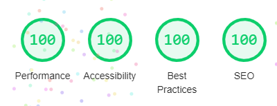

# 100% Lighthouse Score

Today, [osm.software](https://osm.software/) reached important milestone - 100% [Lighthouse](https://developers.google.com/web/tools/lighthouse/) score. 

Lighthouse evaluates the factors with the strongest impact on the
user experience, and according to Lighthouse, this website performs really well.  

More information:

{{ toc }}

### meta.list_text

Today, *osm.software* reached important milestone - 100% *Lighthouse* score.

## About Lighthouse

According to its webpage:

> Lighthouse is an open-source, automated tool for improving the quality of web pages. You can run it against any web page, public or requiring authentication. It has audits for performance, accessibility, progressive web apps, SEO and more.

## Performing The Test

1. Open [osm.software](https://osm.software/) in Chrome. 
2. Press `F12` to open Developer Tools.
3. Press `Generate Report button` in the `Lighthouse` tab. 