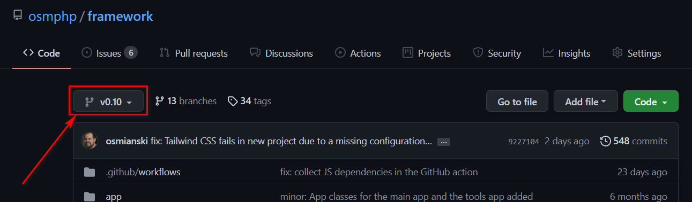

# Contributing Changes

This article provides a practical example of contributing changes to Osm Framework and other `osmphp/*` GitHub repositories. It's based on [the `Osm_Project` application pull request](https://github.com/osmphp/core/pull/2). 

Contents:

{{ toc }}

## meta.list_text

This article provides a practical example of contributing changes to Osm Framework
and other `osmphp/*` GitHub repositories. It's based
on *the `Osm_Project` application pull request*.

## Rules

Send bug fixes, and minor features to the current release branch. Prefix commit
messages with `fix:` and `minor:`, respectively:

Send major new features should always be sent to the upcoming release branch (
for `v0.10` current release, it's `v0.11`; for `v2`, it's `v3`, and so on).
Prefix commit messages with `major:`.

In case the upcoming release branch doesn't exist yet, ask maintainer to create it in repository Discussions.

## Workflow

1. Use "Fork" button to fork [the relevant repository](https://github.com/osmphp) (in our example, it's `osmphp/core`) into your account (in my case, `osmianski`).

2. Clone the repository to your computer using `git clone` command:

        git clone git@github.com:osmianski/core.git
 
3. Implement changes. Write unit tests in order to make sure that future changes made by other contributors won't break yours.  

4. Commit and push the changes to your fork:

        git add .
        git commit -am "major: new `Osm_Project` application"
        git push
        
5. Create new pull request in the original repository, click `compare across
   forks`. In `base repository`, pick [current or upcoming branch](#rules) of the original repository. In `head repository`, pick the branch you made changes on. Click `Create pull request`, enter description, and click `Create pull request` again. See also [Creating a pull request from a fork](https://docs.github.com/en/github/collaborating-with-pull-requests/proposing-changes-to-your-work-with-pull-requests/creating-a-pull-request-from-a-fork).
   
## Using Fork In Your Project

While the maintainer reviews and merges your pull request, you can use your fork instead of original repository in your project. Instruct Composer to use the fork, and your branch in the project's `composer.json`, and run `composer update`:

    {
        ...
        "require": {
            ...
            "osmphp/core": "v0.8.x-dev"
        },
        ...
        "repositories": [
            {
                "type": "vcs",
                "url": "https://github.com/osmianski/core"
            }
        ]
    }
 
**Note**. `v0.8.x-dev` version constraint in `composer.json` stands for `v0.8` Git branch. For more information, read about [Composer branch constraints](https://getcomposer.org/doc/articles/versions.md#branches).      

