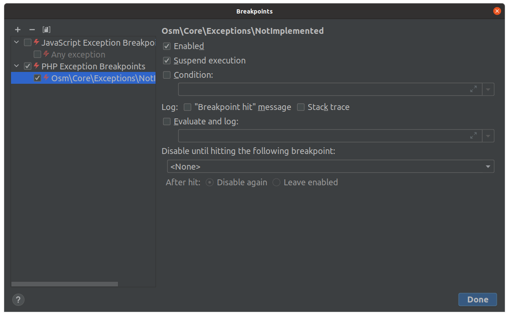

# `NotImplemented`

Have you even written a comment like this one? 

    function foo(?Bar $bar): void {
        // TODO: handle nulls
        ...
    }

Previously, I had those, too. 

Not anymore. 

I found that throwing the [`NotImplemented`](https://github.com/osmphp/core/blob/HEAD/src/Exceptions/NotImplemented.php) exception instead of a mere comment makes more sense to me - whenever you hit that line, the exception forces you to pay off this bit of technical debt: 

    function foo(?Bar $bar): void {
        if (!$bar) {
            throw new NotImplemented();        
        }
        
        ...
    }

Only recently, I have found a really nice feature in PhpStorm called *Exception Breakpoints*. The idea is that whenever a specified exception is thrown, the debugger stops at the line that throws the exception. 

And it's a perfect match for the `NotImplemented` exception. After configuring it, the debugger stop anytime when the execution hits a feature, or a special case, that is not implemented yet. 

Configure it in `Run -> View Breakpoints` by pressing `+ -> PHP Exception Breakpoints`, entering the full exception class name, and pressing OK:

### meta.abstract

Throw the `NotImplemented` exception in any code path that is not implemented yet, and configure the debugger to stop there whenever the code path is executed. 
