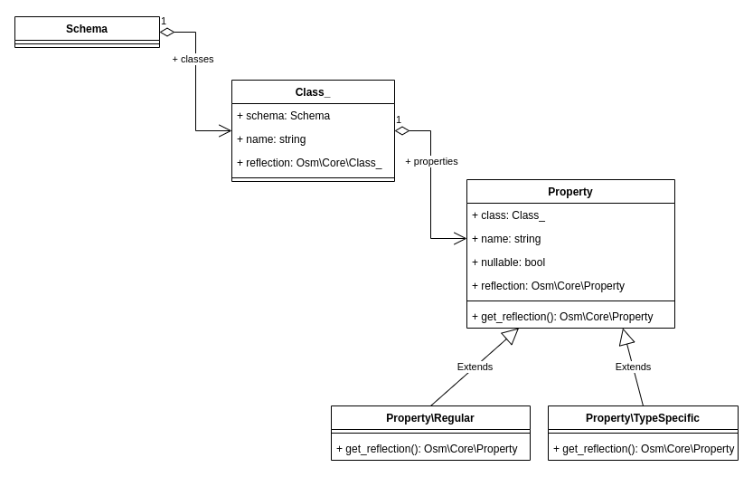

# Schema Hydration

I developed [`dehydrate()/hydrate()`](11-framework-hydration.md) functions for a very practical need - storing the data class schema:

* in cache - to reduce processing time spent on reflection;
* and in database - to compare current and new database schema, and only add new tables and columns. 

This article describes the information stored in the schema, and [unit tests](https://github.com/osmphp/admin/blob/HEAD/tests_migrations/test_01_schema_hydration.php) that I prepared in order to be sure that schema classes are property hydrated. 

Contents:

{{ toc }}

### meta.abstract

I developed *`dehydrate()/hydrate()`* functions for a very practical need - storing the data class schema:

* in cache - to reduce processing time spent on reflection;
* and in database - to compare current and new database schema, and only add new tables and columns.

This article describes the information stored in the schema, and *unit tests* that I prepared in order to be sure that schema classes are property hydrated.

## What's In Schema, Anyway?

For now, let's focus on the primary aspect of the data schema, that is information about data classes. There is a lot more information - about underlying database tables that store data objects, about grids and forms UI components that allow viewing and editing data objects - but I'll return to that later.

Let's begin with some example. In an e-commerce application, there are products of different types: bags, dresses, and others. For more information about subclasses, see [Subclasses](04-data-subclasses.md). 

The `Product` data class specifies the common product properties while `Bag` and `Dress` subclasses specify type-specific properties:

    use Osm\Core\Traits\SubTypes;
    use Osm\Core\Attributes\Type;
    use Osm\Admin\Base\Attributes\Storage;
    ...
    
    /**
     * @property string $sku #[Serialized]
     * @property string $description #[Serialized]
     */
    #[Storage\Table('products')]
    class Product extends Object_
    {
        use Id, SubTypes;
    }

    /**
     * @property string $color #[Serialized]
     */
    #[Type('bag')]
    class Bag extends Product {
    }  

    /**
     * @property string $color #[Serialized]
     * @property string $size #[Serialized]
     */
    #[Type('dress')]
    class Dress extends Product {
    }  

Schema collects all classes marked with a `#[Storage\*]` attribute, their subclasses, and all the classes used as their property types, recursively.

In addition, all type-specific properties are collected into the definition of the base class.

## Schema Classes

The following diagram shows the data structure that contains the collected information about data classes:

      

As you see, the `Schema` object contains an array of `Class_` objects for each collected class, and each `Class_` object contains an array of serialized properties, each being an instance either of `Property\Regular` class - if it's a base class property, or `Property\TypeSpecific` class - if it's a property of a subclass. 

## Unit Tests

In the [test_01_schema_hydration.php](https://github.com/osmphp/admin/blob/HEAD/tests_migrations/test_01_schema_hydration.php) file, There are two unit tests: one tests dehydration/hydration process, the other one - native PHP serialization/un-serialization process. Hydration is used to store objects in the database and send/receive them over HTTP. Serialization is used to store objects in cache:

    public function test_hydration() {
        // GIVEN a schema reflected from PHP classes
        $schema = $this->app->schema;

        // WHEN you dehydrate it and then hydrate it back again
        $dehydrated = dehydrate($schema);
        $hydrated = hydrate(Schema::class, $dehydrated);

        // THEN it's the exact copy of the original schema
        $this->assertSchemaHydrated($schema, $hydrated);
    }

    public function test_serialization() {
        // GIVEN a schema reflected from PHP classes
        $schema = $this->app->schema;

        // WHEN you serialize it and then unserialize it back again
        $serialized = serialize($schema);
        $unserialized = unserialize($serialized);

        // THEN it's the exact copy of the original schema
        $this->assertSchemaHydrated($schema, $unserialized);
    }

In both cases, the successful recovery of the schema object is verified using `assertSchemaHydrated()` method. For each class, this method calls `assertClassHydrated()` method, which, in turn, for each property class `assertPropertyHydrated()` method.

### Testing Subclasses

One thing to check is hydration of subclasses. If a property is of a `Property\Regular` class, then it should be hydrated back as `Property\Regular`. If it doesn't, then either the base class isn't using the `SubTypes` trait, or the subclasses don't use `#[Type]` attribute:

    class Property extends Object_
    {
        use SubTypes;
        ... 
    }

    #[Type('regular')]
    class Property\Regular extends Property
    {
        ...
    }
    
Here is how it's verified:

    protected function assertPropertyHydrated(Property $original,
        Property $hydrated, Schema $hydratedSchema): void
    {
        $this->assertTrue($original::class === $hydrated::class);
        ...
    }

### Testing Parent References

The other easy-to-miss thing is parent references. Each class object is assigned a reference to its parent schema object, and each property object is assigned a reference to its parent class object. In order to avoid having circular references, the parent references are not dehydrated, and after hydration they should be manually restored in the `__wakeup()` method:

    /**
     * @property Class_[] $classes #[Serialized]
     */
    class Schema extends Object_
    {
        ...
        public function __wakeup(): void {
            foreach ($this->classes as $class) {
                $class->schema = $this;
            }
        }
    }    
    
    /**
     * @property Property[] $properties #[Serialized]
     * ...
     */
    class Class_ extends Object_
    {
        ...
        public function __wakeup(): void
        {
            foreach ($this->properties as $property) {
                $property->class = $this;
            }
        }
    }
    
Here is how it's verified:

    protected function assertClassHydrated(Class_ $original,
        Class_ $hydrated, Schema $hydratedSchema): void
    {
        $this->assertTrue($hydrated->schema === $hydratedSchema);
        ...
    }

    protected function assertPropertyHydrated(Property $original,
        Property $hydrated, Schema $hydratedSchema): void
    {
        $this->assertTrue($hydrated->class ===
            $hydratedSchema->classes[$hydrated->class->name]);
        ...            
    }

### Testing Other Data

The rest assertions check that all the data is properly restored. Some data is `#[Serialized]` into the dehydrated state as is, other is computed from the serialized data. 

