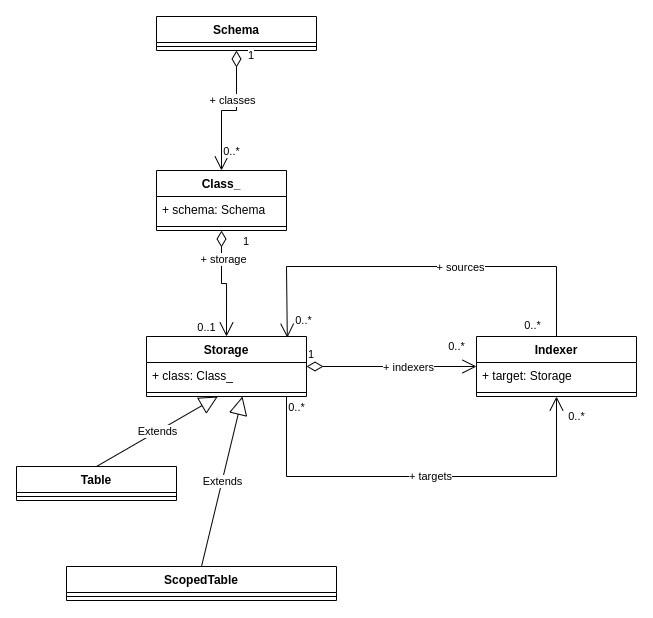

# Indexing

It's often needed to compute, or *index*, data in database tables based on data in other tables.

This article is the first sketch of a consistent indexing solution.

Contents:

{{ toc }}   

### meta.abstract

It's often needed to compute, or *index*, data in database tables based on data in other tables.

This article is the first sketch of a consistent indexing solution.

## Indexed Properties In Data Objects

Let's add computed `level` and `id_path` properties to the `Scope` class that will help to deal with hierarchical nature of scopes:

    /**
     * @property ?int $parent_id #[
     *      Serialized,
     *      Table\Int_(unsigned: true, references: 'scopes.id', on_delete: 'cascade'),
     * ]
     * @property int $level #[Serialized, Table\Int_(unsigned: true)]
     * @property string $id_path #[Serialized, Table\String_()]
     * @property ?string $title #[Serialized]
     */
    #[Storage\Table('scopes')]
    class Scope extends Object_
    {
        use Id;
    }

### `Scope::$level`

`level` equals 0 for the root scope, and it's `parent.level + 1` for all other scopes.

`level` is computed on insert, and on `parent_id` or `parent.level` change.

### `Scope::$id_path`

For the root scope, `id_path` equals `id` converted to string. For other scopes, it's `{parent.id_path}/{id}`.

It's computed on insert, and on `parent_id` change.

## Queries

You'll be able to create/edit/delete scopes via Admin UI, HTTP API, or directly in code. Either way, you'll use *queries* to do the actual manipulation. Let's see how scope queries will look like.

### Creating Global Scope

The root scope is created during initial schema migration:

    class Storage\Scopes extends Storage\Table
    {
        public function seed(?Storage $current): void
        {
            $this->query()->insert((object)[
                'title' => __('Global'),
            ]);
        }
    }    

After the initial migration, the `scopes` table had a record for the root scope:

    id  parent_id   level   id_path data
    1   null        0       1       {"title": "Global"}

### Retrieving Scopes

Then, you can query `scopes` table with the Laravel-like `where()/get()/first()/value()` syntax:

    $rootId = query(Scope::class)
        ->whereNull('parent_id')
        ->value('id');

### Creating Child Scopes

You can create child scopes manually using the insert method:

    $retailId = query(Scope::class)->insert((object)[
        'title' => __('Retail'),
        'parent_id' => $rootId,
    ]);
    $enId = query(Scope::class)->insert((object)[
        'title' => __('English'),
        'parent_id' => $retailId,
    ]);
    $deId = query(Scope::class)->insert((object)[
        'title' => __('Deutsche'),
        'parent_id' => $retailId,
    ]);

`scopes` table:

    id  parent_id   level   id_path data
    1   null        0       1       {"title": "Global"}
    2   1           1       1/2     {"title": "Retail"}
    3   2           2       1/2/3   {"title": "English"}
    4   2           2       1/2/4   {"title": "Deutsche"}

### Updating Scopes

You can mass-update scopes based on some criteria:

    query(Scope::class)
        ->where('parent_id', $retailId)
        ->update((object)[
            'parent_id' => $rootId,
        ]);

`scopes` table:

    id  parent_id   level   id_path data
    1   null        0       1       {"title": "Global"}
    2   1           1       1/2     {"title": "Retail"}
    3   1           1       1/3     {"title": "English"}
    4   1           1       1/4     {"title": "Deutsche"}

### Deleting Scopes

You can mass-delete scopes based on some criteria:

    query(Scope::class)
        ->where('id', $retailId)
        ->delete();

`scopes` table:

    id  parent_id   level   id_path data
    1   null        0       1       {"title": "Global"}
    3   1           1       1/3     {"title": "English"}
    4   1           1       1/4     {"title": "Deutsche"}

## Indexing

What's left is to implement *indexing* - a process that tracks data changes and updates dependent data based on specified computation logic.

Let's begin.

### Indexers

After inserting, updating or deleting an object in a table - the *indexing source* ,- the query also invokes the *indexers* to update other tables that contain dependent data - the *indexing targets*:

As you can see, an indexer may have many source tables. Also, a target table may have many indexers that update it, each updating its own part of the target.

Declare an indexer by extending the `Indexer` class and specifying its short unique name, sources and targets using the `#[Name]`, `#[Source]` and `#[Target]` attributes:

    #[
        Name('scope'), 
        Source(Scope::class, insert: true, update: true, delete: true), 
        Target(Scope::class, insert: true, update: true, delete: true)
    ]
    class Indexers\Scope extends Indexer
    {
    }

### Computation Logic

Provide the computation logic for the `level` and `id_path` properties in the `index_level()` and `index_id_path()`, accordingly:

    class Indexers\Scope extends Indexer
        protected function index_level(?Scope $parent): int {
            return $parent->level ?? 0;        
        }
        
        protected function index_id_path(?Scope $parent, int $id): string {
            return $parent ? "{$parent->id_path}/{$id}" : "{$id}";
        }
    }

Both methods expect `parent` as a parameter, provide it in the `index_parent()` method:

    class Scopes extends TableQuery {
        ...
        protected function index_parent(?int $parent_id): ?Scope {
            return $parent_id
                ? query(Scope::class)
                    ->where('id', $parent_id)
                    ->hydrate()
                    ->first(['level', 'id_path'])
                : null;
        }
    }

### Computing Property Values Before INSERT Or UPDATE

Before running the underlying `INSERT` statement, the `query(...)->insert()` method runs `inserting()` method of the table indexer. If there are several indexers that update the target table, all of them are called, and each decides whether it should do something.

Similarly, the `query(...)->update()` method calls the `updating()` method of the table indexer.

These methods execute `index_*()` methods and add computed values to the inserted/updated data.

### Computing Property Values After Changes In Source Tables

After INSERT, UPDATE or DELETE in a table, `index()` method is executed in all indexers that list that table as a source. 

The `index()` method inserts, updates, or deletes the records in the target table using the computation logic specified in the `index_*()` methods.