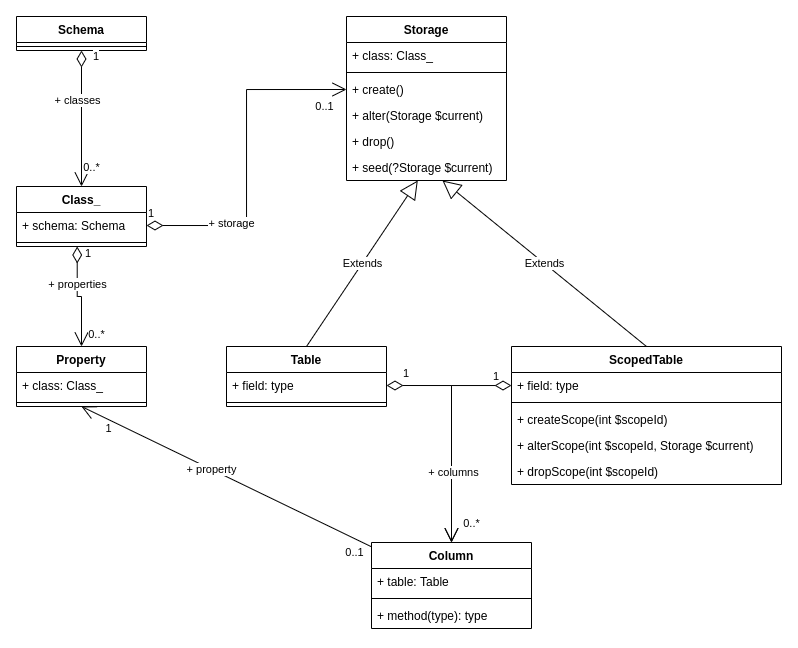

# 2021 Nov 8 - Nov 19

I had two weeks full of meaningful, productive work. I started with sketching Osm Admin grid and form pages, and implemented a very basic, but working home page, and success/error messages. To enable that, Osm Framework now have extensible Blade templates, and a nice JavaScript solution for capturing user input into a modal dialog box, or into some picker component.

Then, I undertook a major refactoring of Osm Admin, including moving lots of pieces of code to their new places, stabilizing the underlying object model, rewriting database migrations and sketching future effort on data indexing. During this effort, I implemented generic object hydration and reflection over named subtypes. 

I've already shared most of this information on Twitter, so if you are reading this, consider [following me on Twitter](https://twitter.com/v_osmianski) and getting daily updates.

More details:

{{ toc }}

### meta.abstract

I had two weeks full of meaningful, productive work. I started with sketching Osm Admin grid and form pages, and implemented a very basic, but working home page, and success/error messages. To enable that, Osm Framework now have extensible Blade templates, and a nice JavaScript solution for capturing user input into a modal dialog box, or into some picker component.

Then, I undertook a major refactoring of Osm Admin, including moving lots of pieces of code to their new places, stabilizing the underlying object model, rewriting database migrations and sketching future effort on data indexing. During this effort, I implemented generic object hydration and reflection over named subtypes. 

I've already shared most of this information on Twitter, so if you are reading this, consider *following me on Twitter* and getting daily updates.

## Osm Admin v0.1.1

[Diff](https://github.com/osmphp/admin/compare/v0.1.0...v0.1.1)

Despite a modest change in the version number, I've refactored a lot of things in Osm Admin. Here are the main ones.

### Attributes

All PHP attribute definitions are moved into the `Osm\Admin\Base\Attributes` namespace:

* `#[Storage\*]` attributes mark data classes that are [stored in the database](17-data-database.md).
* `#[Table\*]` attributes mark data class properties that are [stored in dedicated table columns](17-data-database.md).
* `#[Markers\*]` attributes are [markers](#markers)
* `#[Grid\*]` attributes specify how a data class is viewed/edited in a grid.
* `#[Form\*]` attributes specify how a data class is viewed/edited in a form.
* `#[Icon]` attribute adds a link to a data class grid page to the home page of the admin area. 

### Markers

Marker attributes bind attributes to behavior classes. 

Let's illustrate it with an example. `#[Storage\Table('products')]` attribute declare that a data class is stored in the database `products` table:

    #[Storage\Table('products')]
    class Product extends Object_ {
    }

The exact details of creating the `products` table are implemented in `Osm\Admin\Tables\Table` class:

    #[Type('table')]
    class Table extends Storage {
        ...
    }

How does the application know that? It checks the type name specified in the marker attribute `#[Markers\Storage]` applied to the definition of the `#[Storage\Table]` attribute:

    #[\Attribute(\Attribute::TARGET_CLASS), Storage('table')]
    final class Table {
    }
       
Then it finds a storage class that has the same type name specified in its `#[Type]` attribute, and it's the `Osm\Admin\Tables\Table` class.

### Schema

In Osm Core package, I developed [`dehydrate()/hydrate()`](11-framework-hydration.md) functions, and I use these functions to [store the data class schema in cache and in database](15-data-schema-hydration.md). I've also finalized the design of the data class schema:

### Database Migrations

I've finished refactoring how Osm Admin stores data objects in the database. Also, in order to support multi-website, multi-vendor, multi-language applications, I've introduced the concept of *scopes*. The database layout is documented in [this post](17-data-database.md), and the information about database tables and other storages is a part of the data schema:

 

### Indexing

It's often needed to compute, or *index*, data in database tables based on data in other tables. I've sketched [how it might work](18-data-indexing.md), and I think of implementing it in the next iteration.

## Osm Framework v0.13.22

[Diff](https://github.com/osmphp/framework/compare/v0.13.13...v0.13.22)

This minor update comes with two new features: blade traits and modal input capturing.

### Blade Traits

Starting from this version, Osm Framework allows injecting your HTML markup into any place of a standard Blade template. For example, if your `messages` module needs to add a message template markup after the page footer, at the very end of the page, define a *blade trait* in the `themes/_base/views/messages/traits/std-pages/layout.blade.php`:

    @around({{ $footer }})
        @proceed
        <template id="message-template">
            ...
        </template> 
    @endaround

The file name tells the templating engine that `messages` module modifies `std-pages::layout` Blade template, the `@around` directive tell to find `{{ $footer }}` and replace it with the directive body, and `@proceed` directive renders original content, that is, `{{ $footer }}`.

Find more about this feature in the [dedicated blog post](08-framework-blade-traits.md).

### Modal Input Capturing

When active, modal elements - dialogs, pickers, or AJAX spinners - need to prevent user interaction with the rest of the page.

A common approach is putting an overlay `
` under the modal element covering the rest of the page, as a click shield. However, user can still navigate the page with the keyboard.

This version of Osm Framework comes with a [better solution](09-framework-modal-elements.md). It allows capturing mouse and focus events outside the modal element, and keeping focus inside.

## Osm Core v0.10.11

[Diff](https://github.com/osmphp/core/compare/v0.10.4...v0.10.11)

### Object Hydration

This version introduced a couple of helper functions for transmitting PHP objects over the wire, and saving them in database records:

* `dehydrate()` - recursively converts an instance of a PHP class to a plain untyped object. Then, store the plain object in the database, or convert it to JSON and send it to a browser.
* `hydrate()` - recursively converts a plain untyped object back to a PHP class instance. Use if after decoding a JSON received from the browser, or after loading a database record.

Example:

    use function Osm\dehydrate;
    use function Osm\hydrate;
    ...
    $json = json_encode(dehydrate($order));
    ...
    $order = hydrate(Order::class, json_decode($json));

In-depth look - in the [blog post](11-framework-hydration.md).

### Reflecting Over Subtypes

From now on, you can retrieve subclasses marked with a `#[Type]` attribute using new `Class_::types` property:

    global $osm_app; /* @var App $osm_app */
    
    $productClass = $osm_app->classes[Product::class];
    
    $dressClass = $productClass->types['dress']; 

## *osm.software* Website v0.4.3

[Diff](https://github.com/osmphp/osmsoftware-website/compare/v0.4.2...v0.4.3)

### New Content

I've documented the new features of Osm Framework and Osm Admin in the blog:

* Osm Admin
    * [Schema](15-data-schema-hydration.md)
    * [Database](17-data-database.md) 
    * [Indexing](18-data-indexing.md) 
* Osm Framework
    * [Blade Traits](08-framework-blade-traits.md) 
    * [Capturing Modal Input](09-framework-modal-elements.md) 
    * [Object Hydration](11-framework-hydration.md) 

### Other Changes

As number of blog articles grows in each category, they don't fit the default limit of 10 posts per page. I removed the limit for now. 

Later, I'll return to post pagination with something similar to infinite scrolling, but better. 

