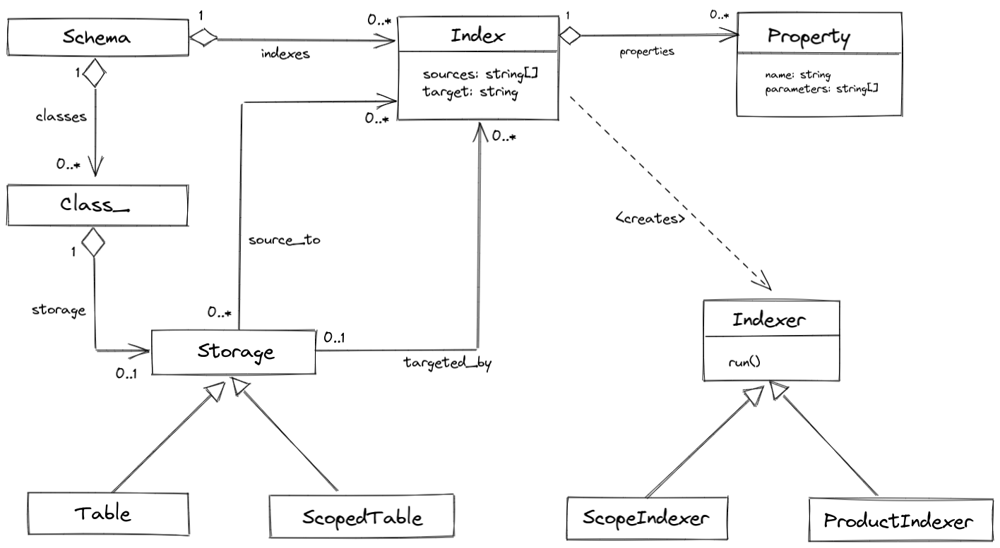

# Indexing (2)

Today, I implemented computation of indexed properties during insert. The implementation dictated some changes in indexed property definitions compared to the [initial design](18-data-indexing.md), and how indexers are reflected into the data schema.

Also, I implemented a table query class working on top of Laravel [`Query\Builder`](https://laravel.com/docs/queries). More about it next time, for now I'll review how indexed properties are computed during INSERT operation.

More details:

{{ toc }}

### meta.abstract

Today, I implemented computation of indexed properties during insert. The implementation dictated some changes in indexed property definitions compare to the *initial design*, and how indexers are reflected into the data schema.

Also, I implemented a table query class working on the top of Laravel `Query\Builder`. More about it next time, for now I'll review how indexed properties are computed during INSERT operation.

## Indexers And Indexed Properties

Let's recap the [initial indexing design](18-data-indexing.md) with some changes I made while implementing INSERT operation.

A data class may contain *indexed properties* that are computed from other parts in the database whenever they change. The process of computing indexed properties is called *indexing*.

Indexing is performed by *indexers* - classes derived from the `Indexer` class. Each indexer specifies one or more *sources* - from where it takes the source data, and the *target* - where it put computed data. Most often, sources and targets are database table names. 

For example, the `ScopeIndexer` computes indexed properties in the `scopes` table based on the values stored in a parent record in the same table:

    use Osm\Admin\Base\Attributes\Indexer\Source;
    use Osm\Admin\Base\Attributes\Indexer\Target;
    ...
    #[Target('scopes'), Source('scopes')]
    class ScopeIndexer extends TableIndexer
    {
        ...
    }    

Each indexer contains the computation logic for the indexed properties in its `index_*()` methods. For example, the `ScopeIndexer` computes three properties - `level`, `id_path`, and `parent`:

    #[Target('scopes'), Source('scopes')]
    class ScopeIndexer extends TableIndexer
    {
        protected function index_level(?Scope $parent): int {
            return $parent ? $parent->level + 1 : 0;
        }
    
        protected function index_id_path(?Scope $parent, int $id): string {
            return $parent ? "{$parent->id_path}/{$id}" : "{$id}";
        }
    
        protected function index_parent(?int $parent_id): Scope|Object_|null {
            return $parent_id
                ? query(Scope::class)
                    ->raw(fn(QueryBuilder $q) => $q->where('id', $parent_id))
                    ->hydrate()
                    ->first(['level', 'id_path'])
                : null;
        }
    }

Each `index_*()` method specifies data required for computation in its parameters. Some data, for example `parent_id`, is manually filled in by the user. `id` is assigned by the database engine. Other data, such as `parent`, is computed by other `index_*()` methods.  

## Index Information In Schema

Information about each indexer class is reflected into `Index` objects, and information about all its indexed properties goes to `Indexing\Property` objects. All `Index` objects are a part of the schema:

A `Table`, or `ScopedTable`, detects indexes it's `targeted_by` by its table name written in the index `target` property. It also detects indexes it's `source_to` by its table name written in the index `sources` property.

`Schema::$indexes` is sorted by index dependency. Keys in this array are indexer class names.

`Index::$properties` are sorted by computation dependency.

Keys in `Storage::$targeted_by` are type names targeted by indexes , or an empty string `''` if an index targets all objects of the data class.

## How Indexed Properties Are Computed On INSERT
  
Before inserting provided data object into the underlying table, all the `index_*()` methods of the indexer that targets it are invoked, and their results are added to the inserted object.

The methods are invoked starting from the least dependent. For example, the `index_level()` method expects `parent` property, so it's invoked after calling `index_parent()` method.

If an indexing method expects `id`, it's postponed after INSERT, as ID is not assigned to the record yet. For example, `index_id_path()` method expects `id`, so it invoked after the INSERT operation takes place, and the computed value added to the inserted record with an additional UPDATE.

### Example 

For example, consider an INSERT statement from the [test suite](https://github.com/osmphp/admin/blob/HEAD/tests/test_01_scopes.php):

    $retailId = query(Scope::class)->insert((object)[
        'title' => __('Retail'),
        'parent_id' => 1,
    ]); 
    
The `insert()` is handled as follows:

1. the underlying indexer, `ScopeIndexer`, computes and adds `parent` and `level` properties to the object being inserted:

        $data = (object)[
            'title' => __('Retail'),
            'parent_id' => 1,
            'parent' => Scope::new(['level' => 0, 'id_path' => 1]),
            'level' => 1, 
        ];

2. The object is inserted into the database. The `title` property doesn't have a dedicated column and goes to `data` JSON. The `parent` property is not defined as a serialized property in the data class, and is not saved:          

        id  parent_id   level   id_path data
        2   1           1       null    {"title": "Retail"}

3. The record ID is added to the data object:

        $data = (object)[
            'title' => __('Retail'),
            'parent_id' => 1,
            'parent' => Scope::new(['level' => 0, 'id_path' => 1]),
            'level' => 1,
            'id' => 2,  
        ];
 
4. The postponed `id_path` property is computed and added to the data object:

        $data = (object)[
            'title' => __('Retail'),
            'parent_id' => 1,
            'parent' => Scope::new(['level' => 0, 'id_path' => 1]),
            'level' => 1,
            'id' => 2,  
            'id_path' => '1/2', 
        ];
 
5. Postponed properties are assigned to the record with an additional update:

        id  parent_id   level   id_path data
        2   1           1       1/2     {"title": "Retail"}
 