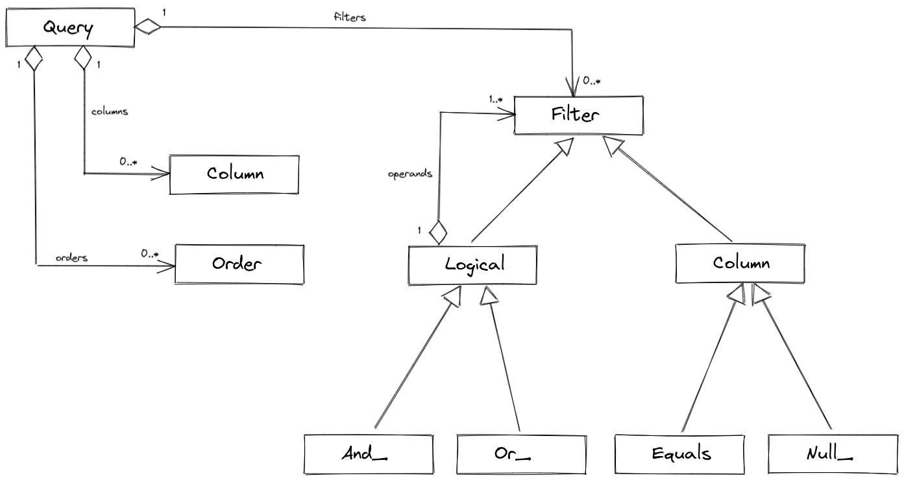

# Better Query Model

I decided to support selecting, filtering and ordering by properties of a related object using dot syntax: `product.price`, `parent.level`. This syntax will automatically join the table that stored related objects.

I realized that implementing joins requires a better query model than my current naive wrapper around Laravel query. This article describes the new query model.

{{ toc }}

### meta.abstract

I decided to support selecting, filtering and ordering by properties of a related object using dot syntax: `product.price`, `parent.level`. This syntax will automatically join the table that stored related objects.

I realized that implementing joins requires a better query model than my current naive wrapper around Laravel query. This article describes the new query model.

## Query Methods

The `query()` function returns an instance of a class that extends the `Query` class:

    /* @var TableQuery $query */
    $query = query(Scope::class);

The query object will have methods for applying filters, selecting properties, and ordering by them:

    $scope = query(Scope::class)
        ->whereEquals('parent_id', 1)
        ->or(fn(Filter\Logical\Or_ $q) => $q
            ->whereNull('id_path')
            ->whereGreaterThan('id, 5')
        )
        ->orderBy('title', Query::ASCENDING)
        ->first(['id', 'title', 'parent.title']);

All these methods will add filters, order, and selection to internal arrays: `filters`, `orders` and `columns`, respectively.

And when call the `first()`, `get()` or other method that actually hits the database, the internal arrays will be converted to the Laravel query, which will execute actual SQL. 

## New Query Model

So let's see how the query will store its configuration:

Query methods add `Column`, `Order` and `Filter` objects to the respective arrays. 

Filters can be of different types: equality filter, nullability filter, regex matching filter, and more. Logical filters, such as logical OR, may have child filters - `operands`.

## What's Next

I've started a refactoring based on this model, and implementing the dot syntax, and soon it will be clear how it goes, so stay tuned!            