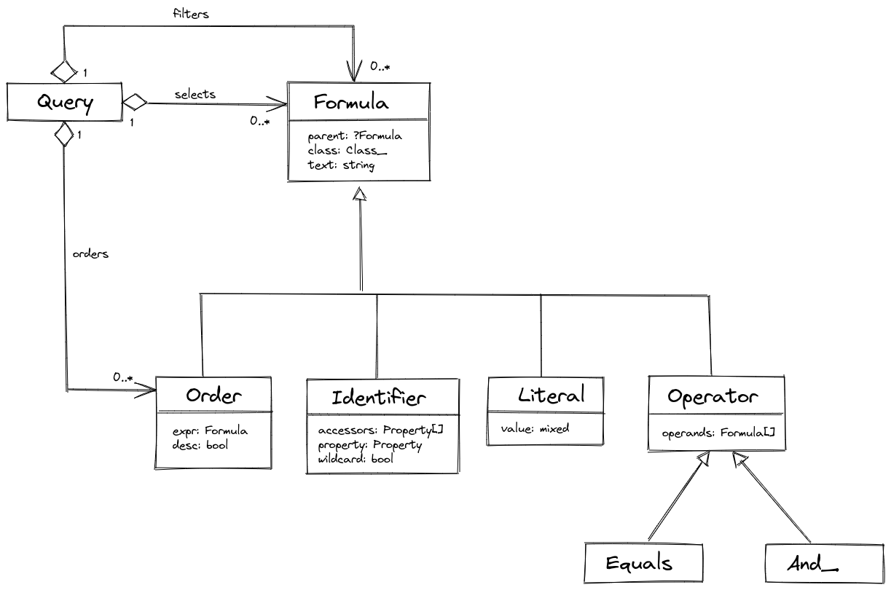

# Query Formulas

After 3 days of intensive work, I've got the dot syntax working!

Along the way, I refactored the query internals once again, which reminds me a heuristics saying that you've got to implement something three times to get it right :)

New query implementation uses the concept of *formulas* - SQL-like expressions used for selecting, filtering and sorting data. Currently, formulas are quite limited, but with time, they should be a really powerful feature.

Implementation details:

{{ toc }}

### meta.abstract

After 3 days of intensive work, I've got dot syntax working!

Along the way, I refactored the query internals once again, which reminds me a heuristics saying that you've got to implement something three times to get it right :)

New query implementation uses the concept of *formulas* - SQL-like expressions used for selecting, filtering and sorting data. Currently, formulas are quite limited, but with time, they should be a really powerful feature.  

## Recap

For a moment, let's recap how queries fit the Osm Admin package. 

Osm Admin is a package for defining data, generating database tables for storing it, and rendering visual and programmable interfaces for users to view and edit it.

These interfaces - the visual admin UI and the programmable API - different from your granddad's CRUD application, will be tuned for data object mass editing, and they will use queries to `get()`, `insert()`, `update()` and `delete()` data objects from/in the underlying database table.   

Some data objects will have indexed properties that are computed from other application data, and automatically change when the source data changes. The computation and change propagation - collectively known as indexing - will happen after every query operation. Indexing logic will also use queries to update indexed properties.

## Updated Query Syntax

Since my last post, the query syntax is a bit modified. Let's review it.

The `query()` function returns an instance of a class that extends the `Query` class:

    /* @var TableQuery $query */
    $query = query(Scope::class);

The query object provides methods for applying filters, selecting properties, and ordering by them:

    $scope = query(Scope::class)
        ->equals('parent_id', 1)
        ->or(fn(Formula\Operation $q) => $q
            ->null('id_path')
            ->greater('id', 5)
        )
        ->orderBy('title', desc: true)
        ->first('id', 'title', 'parent.title');

All these methods will add filters, order, and selection to internal arrays: `filters`, `orders` and `selects`, respectively.

And when you call the `first()`, `get()` or other method that actually hits the database, the internal arrays will be converted to the Laravel query, which will execute actual SQL. 

## Formulas

Every filter, order and selection is a *formula*. The query from the above example is internally represented as follows:

    {
        "filters": [
            {
                "type": "equals",
                "operands": [
                    { "type": "identifier", "text": "parent_id" },
                    { "type": "literal", "value": 1 }
                ]
            },
            {
                "type": "or",
                "operands": [
                    {
                        "type": "null",
                        "expr": { "type": "identifier", "text": "id_path" }
                    },
                    {
                        "type": "greater",
                        "operands": [
                            { "type": "identifier", "text": "id" },
                            { "type": "literal", "value": 5 }
                        ]
                    }
                ]
            }
        ]   
    }  

## Future Syntax 

Later, I think about simplifying the query syntax:

    $scope = query(Scope::class)
        ->where('parent_id = 1 AND (id_path = NULL OR id > 5)')
        ->orderBy('title DESC')
        ->first('id', 'title', 'parent.title');

The underlying object model will be the same. With time, this new syntax will also support more operators, for example `+` for string concatenation, and function calls. 

## Object Model

The query stores instances of class that extend the base `Formula` class:

 

## Dot Syntax

Using dot syntax, you can retrieve data from the related tables. 

Let's examine how the dot syntax works on the example of the `Scope` class:

    /**
     * @property ?int $parent_id #[
     *      Serialized,
     *      Table\Int_(unsigned: true, references: 'scopes.id', on_delete: 'cascade'),
     * ]
     * @property Scope $parent #[Serialized]
     * ...
     */
    class Scope extends Object_
    {
        use Id;

        public function join_parent(TableQuery $query, string $joinMethod,
            string $from, string $as): void
        {
            $query->db_query->$joinMethod("scopes AS {$as}",
                "{$from}.parent_id", '=', "{$as}.id");
        }
        ...
    }

Notice that it defines `parent: Scope` property and the `join_parent()` method telling how to join the parent table to the current one.
 
Now if we have a query:

    $scope = query(Scope::class)
        ->equals('parent.id', $child1)
        ->first(
            'id',
            'parent.id',
            'parent.parent.id',
            'parent.parent.parent.id',
            'parent.parent.parent.parent.id',
        ); 
        
Osm Admin automatically joins related tables using the `join_parent()` method:

    select 
        `this`.`id` as `id`, 
        `parent`.`id` as `parent__id`, 
        `parent__parent`.`id` as `parent__parent__id`, 
        `parent__parent__parent`.`id` as `parent__parent__parent__id`,
        `parent__parent__parent__parent`.`id` as `parent__parent__parent__parent__id` 
    from `scopes` as `this` 
    inner join `scopes` as `parent` on `this`.`parent_id` = `parent`.`id` 
    left join `scopes` as `parent__parent` 
        on `parent`.`parent_id` = `parent__parent`.`id` 
    left join `scopes` as `parent__parent__parent` 
        on `parent__parent`.`parent_id` = `parent__parent__parent`.`id` 
    left join `scopes` as `parent__parent__parent__parent` 
        on `parent__parent__parent`.`parent_id` = `parent__parent__parent__parent`.`id` 
    where `parent`.`id` = 3
    
Osm Admin also converts the SQL query result into an object model as defined in the data class and removes `null` values:

    {
        "id": 4,
        "parent": {
            "id": 3,
            "parent": {
                "id": 1
            }
        }
    }