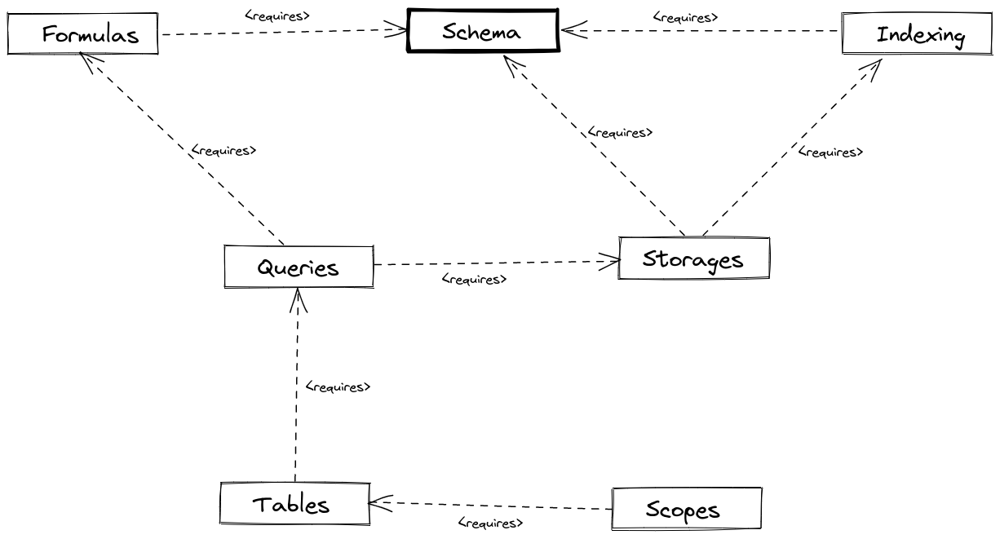

# Modules

I'm still working on indexing, and it seems get one more refactoring. But more on that later.

Meanwhile, let's review Osm Admin modules, their responsibilities and dependencies.

Contents:

{{ toc }}

### meta.abstract

I'm still working on indexing, and it seems get one more refactoring. But more on that later.

Meanwhile, let's review Osm Admin modules, their responsibilities and dependencies.

## Overview

Several modules are gaining shape:

In the above schema, you can see what modules are required by every other module.

## Modules

### `Schema`

The central module that other modules depend on is [`Schema`](../11/15-data-schema-hydration.md). It collects information about data classes and properties, and puts them into the `$osm_app->schema`. 

### `Formulas`

The [`Formulas`](../11/29-data-query-formulas.md) module defines classes for the inner structure of a query: property selection, filters, and sorting. It also contains a rudimentary parser for expressions like `parent.title`.

### `Indexing`

The [`Indexing`](../11/22-data-indexing-2.md) module contains a generic engine for propagating data changes through the rest of the database. It introduces the concept of indexed properties, and it adds information about indexes and indexed properties into the schema. 

### `Storages`

The [`Storages`](../11/17-data-database.md#updated-schema) module defines how data objects are stored, and where they are retrieved from.

### `Queries`

The [`Queries`](../11/23-data-queries.md) module defines the query syntax for retrieving objects from storages, and storing them.

### `Tables`

The [`Tables`](../11/17-data-database.md) module creates database tables for storing data objects there.

### `Scopes`

The [`Scopes`](../11/17-data-database.md#scopes) implements scopes, and creates database tables for storing scope-specific data.