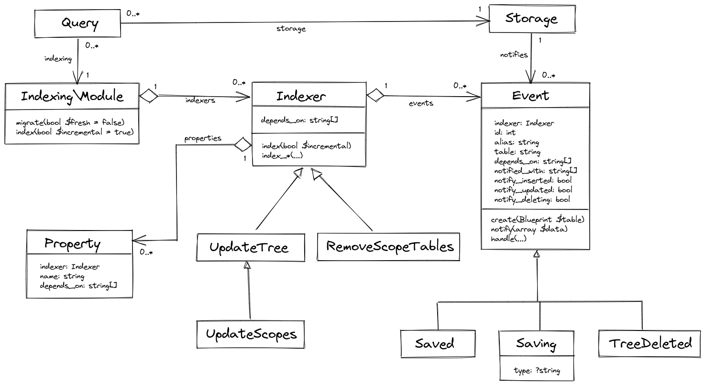

# Indexing (3)

Yay, indexing works!

It's changed quite a bit, so let's review how it works from the very beginning.

Contents:

{{ toc }}

### meta.abstract

Yay, indexing works!

It's changed quite a bit, so let's review how it works from the very beginning.

## Scopes

In this article, I'll  review how indexing helps to manage [scopes](../11/17-data-database.md#scopes). A scope is a generic term denoting a single site/store in a multi-site/multi-store application.

The `Scope` class is defined as follows:

    /**
     * @property ?int $parent_id #[Serialized,
     *      Table\Int_(unsigned: true, references: 'scopes.id', 
     *          on_delete: 'cascade')]
     * @property ?int $level #[Serialized, Table\Int_(unsigned: true)]
     * @property ?string $id_path #[Serialized, Table\String_]
     * @property ?string $title #[Serialized]
     * @property Scope $parent #[Serialized]
     */
    #[Storage\Scopes]
    class Scope extends Object_
    {
        use Id;
    
        public function join_parent(TableQuery $query, string $joinMethod,
            string $from, string $as): void
        {
            $query->db_query->$joinMethod("scopes AS {$as}",
                "{$from}.parent_id", '=', "{$as}.id");
        }
    }

### `id` And `parent_id` Properties

Scopes form a tree. There is the *root* scope, it may have child scopes, each child scope may have its own child scopes, and so on. 

In database, scopes are stored in `scopes` table. Each scope has a unique `id`, and `parent_id` that references the parent scope.

For each scope, the application creates a separate set of [scope-specific tables](../11/17-data-database.md#scoped-tables). For example, in an e-commerce application, each scope has its own table for products. Scope-specific tables follow `s1__products`, `s2__products`, convention, where `1` and `2` are scope IDs. 

### `level` And `id_path` Properties

The application automatically computes `level` and `id_path` properties.

The `level` property specifies how deep a given scope is in the scope tree. The root scope has level of 0, its direct children are at the 1-st level, the grandchildren have the level of 2, and so on.

The `id_path` property contains the IDs of all parent scopes, and the ID of a given scope. For example, if the scope ID is `5`, its parent ID is 3, and its grandparent ID is 1, then the `id_path` is `1/3/5`.

### `title` And Other Data Properties

You can assign each scope its own title. This property is currently irrelevant for understanding indexing, just keep in mind that each scope has some useful data.

### `parent` Property And `join_parent()` Method

The `parent` property is filled in if you retrieve scopes and their parent scopes using [dot syntax](../11/29-data-query-formulas.md#dot-syntax). The `join_parent()` is used to actually join the parent record to the queried scope record.

## Indexers

Indexers make changes to the database, or other storages based on changes made to the database.

There are two indexers that manage scope data.

### `UpdateScopes` Indexer

Whenever a scope is inserted or updated, the `UpdateScopes` computes `level` and `id_path` properties of the updated scopes, and its child scopes, recursively:

    #[On\Saving('scopes'), On\Saved('scopes', alias: 'parent')]
    class UpdateScopes extends UpdateTree
    {
        protected function index_level(?int $parent__level): int {
            return $parent__level !== null ? $parent__level + 1 : 0;
        }
    
        protected function index_id_path(?string $parent__id_path, int $id): string {
            return $parent__id_path !== null ? "{$parent__id_path}/{$id}" : "{$id}";
        }
    }  

The `index_*()` methods specify the computation logic for the *indexed properties*.

The `#[On\*]` attributes specify *events* in the database that trigger this indexer to run. Specifically:

`#[On\Saving]` attribute computes indexed properties on the currently inserted/updated record.

`#[On\Saved]` attribute computes indexed properties on the child records of the currently inserted/updated record. 

`#[On\Saved]` attribute works asynchronously. It stores IDs of inserted/updated records in an auxiliary *notification table*, and does actual computations later. In the future, the asynchronous indexing will be done in background, so that the user don't have to wait for all the indexing to take place.  

### `RemoveScopeTables` Indexer

Whenever a scope is inserted, its scope-specific tables are automatically created by the scope query logic:

    class Scopes extends TableQuery
    {
        protected function insertCommitted(\stdClass $data): void
        {
            $this->class->schema->migrateScopeUp($data->id);
            parent::insertCommitted($data);
        }
    } 
    
However, after the scope is deleted, the scope-specific tables are deleted by the `RemoveScopeTables` indexer:

    #[On\TreeDeleted('scopes')]
    class RemoveScopeTables extends Indexer
    {
        ... 
        public function index(Event $event = null): void {
            global $osm_app; /* @var App $osm_app */
    
            if (!$event || !$event->id) {
                return;
            }
    
            $ids = $this->db->table($event->notification_table)->pluck('id');
            foreach ($ids as $id) {
                $osm_app->schema->migrateScopeDown($id);
            }
        }
    }

The `#[On\TreeDeleted]` attribute, just like `#[On\Saved]`, works asynchronously. It stores ID of a deleted record along with IDs of its child records in the notification table, and processes them later, as specified in the `index()` method. 

## Indexing Engine

Internally, the indexing engine, implemented in the [`Indexing\Module`](https://github.com/osmphp/admin/blob/HEAD/src/Indexing/Module.php) class, analyzes the source code of all indexer classes and collects reflected information into the indexing model:

The engine puts all the indexers into its `indexers` property. Each indexer knows its `events`, fetched from the `#[On\*]` attributes, and indexed `properties`, fetched from the `index_*` methods.

### Indexed Property Dependencies

The engine also analyzes what data each indexed property requires for its computation. For example, the `id_path` property requires `parent.id_path` and `id` properties, they are listed in the method parameters with the double underscore (`__`) used instead of dot (`.`):

    class UpdateScopes extends UpdateTree
    {
        ...
        protected function index_id_path(?string $parent__id_path, int $id): string {
            return $parent__id_path !== null ? "{$parent__id_path}/{$id}" : "{$id}";
        }
    }
    
These dependencies are stored in the `Property::$depends_on`. The dependencies of all properties of an indexer are stored in the `Indexer::$depends_on`. These properties are added to the underlying query when the indexer runs.

### Properties Required By Events

In a similar fashion, the engine analyzes what data is requires for each event. For example, The `TreeDeleted` event required `id` and `id_path` properties, as specified in its `handle()` method:

    class TreeDeleted extends Event
    {
        ...
        protected function handle(int $id, string $id_path): void {
            ...
        }
    }
    
These properties are stored in the `Event::$notified_with`.

### Subscribing To Data Changes

Each event subscribes to INSERT/UPDATE/DELETE operations of the source table using `notify_inserted`, `notify_updated` and `notify_deleting` properties.

For example, The `Saved` event handles inserts and updates:

    class Saved extends Event
    {
        public bool $notify_inserted = true;
        public bool $notify_updated = true;
        ...
    }

### Registering Events

All indexer events are registered in the `events` table. The event IDs are stored in the `Event::$id`. 

The `events` table has two flags:

* `changed` flag indicates that the event has unprocessed change notifications.
* `dirty` flag indicates that indexer should reindex all target records ignoring change notifications.

### Notification Tables

Most events have their own auxiliary notification tables. For example, for an event having the ID of 1 notification table is named `notifications__1`, the event having ID of 2 creates `notifications__2` table, and so on.

Each event class creates its notification table in its `create()` method. For example, the `Saved` event creates a single `id` column, and automatically deletes records if the records in the source table are deleted:

    class Saved extends Event
    {
        ...
        public function create(): void {
            $this->db->create($this->notification_table, function (Blueprint $table) {
                $table->unsignedInteger('id')->primary();
    
                $table->foreign('id')
                    ->references('id')->on($this->table)
                    ->onDelete('cascade');
            });
        }
        ...
    }  

### Initiating Indexing

A query object, returned by the `query()` function, and implemented using the `Query` class ind its descendants, is used to SELECT/INSERT/UPDATE/DELETE data objects, for example:

    $root = $this->app->db->table('scopes')
        ->whereNull('parent_id')
        ->value('id');

    $child1 = query(Scope::class)->insert([
        'title' => __('Child 1'),
        'parent_id' => $root,
    ]);

The query object initiates indexing in two steps:

1. After `insert()`, `update()` and before `delete()`, the query object notifies each event that is subscribed to the changes in the modified table using `$query->storage->notifies` property. Most events write the IDs, and optionally other data from the modified records to the notification table, and mark themselves as `changed`.  

2. After successfully committing the transaction, the query object initiates incremental indexing of all indexers that have unprocessed notifications using the `Indexing\Module::index()` method.

One notable exception to this two-step process is the `Saving` event. Unlike others, it's processed at once, without any delay.   

### Running Indexers

The `Indexing\Module::index()` method executes the `index()` method of each indexer that is either `dirty`, or has one or more `changed` events.

In case the source data is `changed`, the event object is passed to the `index()` method, otherwise, it's null.

Every indexer may have its own logic of how to process the incoming notifications. For example, the base class of the `UpdateScopes` indexer, the `UpdateTree` processes the incoming notifications as follows:

    class UpdateTree extends Indexer
    {
        ...
        public function index(Event $event = null): void {
            if ($event && $event->record_id) {
                $query = $this->query()->equals('id', $event->record_id);
                $data = $this->indexObject($query, $query->first());
                $query->doUpdate($data);
    
                return;
            }
    
            $count = query($this->class_name)
                ->prepareSelect()
                ->max('level') + 1;
    
            for ($level = 0; $level < $count; $level++) {
                $this->indexLevel($level, $event);
            }
        }
    
        protected function indexLevel(int $level, Event $event = null): void {
            $query = $this->query($event)
                ->equals('parent.level', $level)
                ->orderBy('id');
    
            $query->chunk(function (\stdClass $object) use ($query) {
                $data = $this->indexObject($query, $object);
                query($this->class_name)
                    ->equals('id', $object->id)
                    ->update($data);
            });
        }
    
        protected function query(Event $event = null): TableQuery|Query
        {
            $query = query($this->class_name)
                ->select(...$this->depends_on);
    
            if ($this->updates_data) {
                $query->selectData($this->properties);
            }
    
            if ($event) {
                $query->raw(fn(TableQuery $q) =>
                $q->db_query->join("{$event->notification_table} AS " .
                    "{$event->alias}__notification",
                    "{$event->alias}__notification.id", '=',
                    "{$event->alias}.id")
                );
            }
    
            return $query;
        }
    
        protected function indexObject(TableQuery $query, \stdClass $object)
            : \stdClass
        {
            // compute every indexed property
        }
    }

  