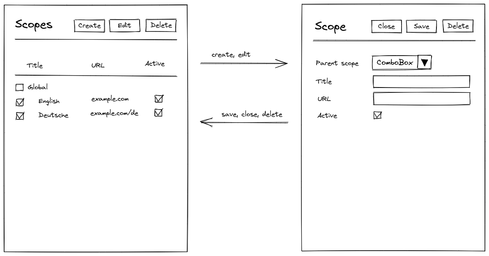

# User Interface For Managing Scopes

So far, I've been concerned about how application data is modeled, stored and handled internally. Yet, the final objective a user interface for viewing and editing it visually. Let's dream a bit about how it might look like.

Contents:

{{ toc }}

### meta.abstract

So far, I've been concerned about how application data is modeled, stored and handled internally. Yet, the final objective a user interface for viewing and editing it visually. Let's dream a bit about how it might look like.

## Visual Sketch 

As an example, let's take [scopes](../11/17-data-database.md#scopes). A scope is a generic term denoting a single site/store in a multi-site/multi-store application.

Here is the initial sketch:

## Managing Scopes

Initially, there is one "global" scope, and you can see it by opening the scope *grid*. You can create more by pressing the `Create` button, which opens scope creation *form*. In the form you enter new scope details, and press the `Save` button. 

You can also edit an existing scope by clicking it in the grid, and using the `Save` button in the opened form. Or, you can edit a scope using the `Delete` button in the form.

You can also tick several scopes and use the grid's `Edit` button, and edit them all at once in a single form. Or, you can use the grid's `Delete` button and delete the selected scopes.  

Finally, you can make a scope inactive (whatever that means) directly in the grid by ticking checkboxes in the `Active` column.

## Viewing Scopes

In case there is a non-trivial number of scopes, the grid should show only the first ones, and load the rest later if scroll the grid down.

You can also sort, filter, or search scope data (visuals omitted for simplicity).  

## Grids And Forms As A Pattern

If you think about it, all the application data can be managed like that. Take products or orders in an e-commerce application, blog posts or static pages in a typical CMS - they all can be viewed in a grid, and edited using a form.  

Of course, actual data applications are more complex than that:

* A form, such as the order form, may have a grid inside. 
* Form fields may require picking values from popup grids.
* Forms may have so many fields that additional navigation cues are needed. 

I'll examine these and other scenarios in more detail later. Yet, let's presume that all these scenarios fit some pattern that can be inferred from data class definitions.