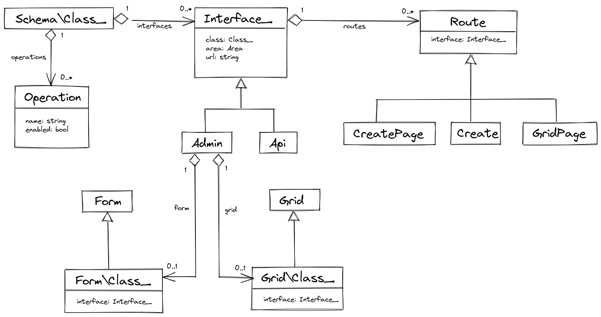

# Interfaces

[Yesterday](07-data-user-interface-for-managing-scopes.md), I described a user interface pattern for managing data of a certain data class using a grid/form pair. Let's call this grid/form pair class *interface* in the [`admin` area](https://osm.software/docs/framework/creating-web-applications/request-response-loop.html#areas).

In this article, I'll examine what moving parts are inside a class interface:

{{ toc }} 

**Note**. Keep in mind that in addition to the `admin` area interface, class may also have non-visual interface in the `api` area that you can use for managing class instances programmatically. I'll return to the topic of the class API later.

### meta.abstract

*Yesterday*, I described a user interface pattern for managing data of a certain data class using a grid/form pair. Let's call this grid/form pair class *interface* in the *`admin` area*.

In this article, I'll examine what moving parts are inside a class interface.

## Overview

Let's start with a diagram:

 

Below, I'll review what various parts of this diagram are for, and where they are inferred from.
 
## Interface URL

The class interface has its own URL assigned in a class attribute. For example, the scope management interface will be served under the `{base_url}/scopes`:

    #[Interface\Admin('/scopes')]
    class Scope extends Object_ {
    }

## Routes

[HTTP routes](https://osm.software/docs/framework/creating-web-applications/request-response-loop.html#routes) that render grid and form pages, and handle user actions on these pages (`Save`, `Delete` and others) are collectively known as *interface routes*. 

Scope management interface, for example, has the following routes:

    GET /scopes/            # grid page
    GET /scopes/load        # load more data (on grid page)
    GET /scopes/create      # create page
    POST /scopes/create     # save new scope (on form and grid pages)
    GET /scopes/edit        # edit page
    POST /scopes/           # save existing scopes (on form and grid pages)
    DELETE /scopes/         # delete action (on form and grid pages)

Some classes may have fewer routes. For example, a class may only allow editing its objects, bot forbid creating or deleting them.  

On the other hand, some classes may have more routes. For example, the `Register` button on a sales order form would execute the `POST /orders/register` route.

## Query Parameters

### Filters

You may wonder how a route knows what data objects it has to retrieve, update or delete. The answer is simple - the object filter is passed in the URL query parameters, for example: 

    GET /scopes/edit?id=1       # edit the global scope     
    GET /scopes/edit?id=1+2+3   # edit selected scopes
    GET /scopes/edit?active     # edit active scopes

Internally, the URL query parameters are translated into filters applied to the underlying database query.

### Autofill

When creating a new scope, you may pass certain autofilled property values. For example, in order to create a scope under the parent scope, specify the parent scope ID in the URL query parameters: 

    GET /scopes/create?parent_id=1

### Other Uses

Other uses of URL query parameters include:

    GET /scopes/?order_by=title
    GET /scopes/load?offset=20&limit=20
    
## Operations

By default, the interface routes implement `insert`, `update`, and `delete` *operations* with data objects.

For classes where a specific operation doesn't make sense, You can disable these operations class attributes:

    #[
        Interface\Admin('/order-lines'),
        Interface\Operation('insert', enabled: false), 
        Interface\Operation('delete', enabled: false), 
    ]
    class Order\Line extends Object_ {
    }

You can add more class-specific operations to class attributes:

    #[Interface\Admin('/orders'), Interface\Operation('register')]
    class Order extends Object_ {
    }

Available interface operations of a class are fetched into `Class_::operations`.

## Defining Routes

Osm Admin finds interface routes by `#[Interface]` attribute. Internally, it has standard route implementations, for example:

    #[Interface(Admin::class, 'GET /')]
    class GridPage extends Route {
    } 

Operation-specific routes are only included if the operation is enabled in the class definition, for example:

    #[Interface(Admin::class, 'POST /create', operation: 'create')]
    class Create extends Route {
    } 

Define class-specific routes, and override standard ones or add your own, by specifying the data class name: 

    #[Interface(Admin::class, 'POST /register', class_name: Order::class, 
        operation: 'register')]
    class Register extends Route {
    } 
    
