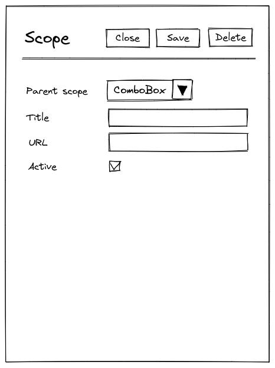
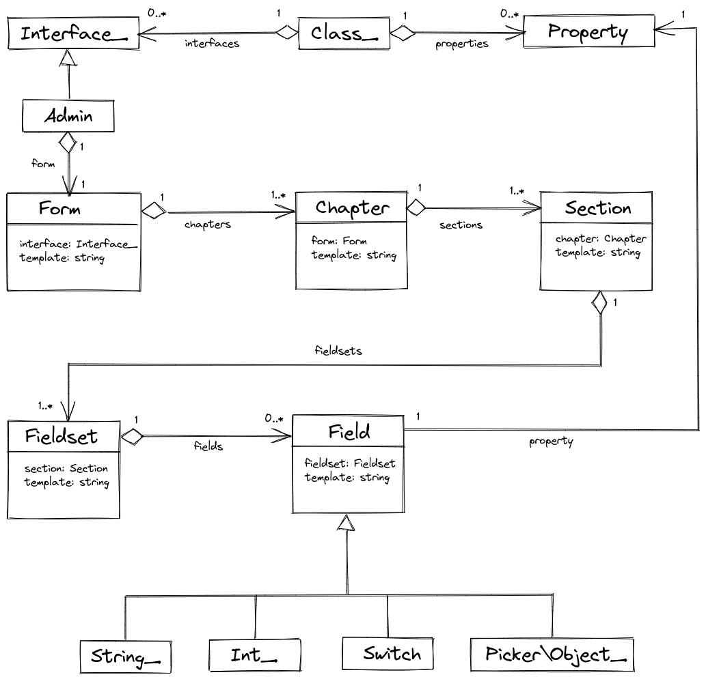

# Forms

In Osm Admin, a *form* is an integral part of the class user interface. It's a very specific kind of HTML form. 

In this article, I'll review what's in a class form, and how it's reflected from the application code.

{{ toc }}

### meta.abstract

In Osm Admin, a *form* is an integral part of the class user interface. It's a very specific kind of HTML form.

In this article, I'll review what's in a class form, and how it's reflected from the application code.

## Inside A Form

Let's begin with an example - the [scope form](07-data-user-interface-for-managing-scopes.md):

    

### Fields

As you can see, form have a *field* for each class property. Some properties are rendered as input fields, some as switches. There will be a lot more *field types*.

Although it's not reflected in the image above, each field may display a help notice explaining its intended use, or, if entered value is invalid, an error message.

Some fields may have a button that opens a *picker* - a popup that helps to select a value from a list, a calendar, or a color palette.

Finally, a field may have a default value, and a user may either enter a custom value, or press a button to use the default one. 

### Fieldsets

In a non-trivial form, fields are logically grouped into *fieldsets*.

Some properties occupy the whole fieldset rather than a single field. For example, order lines are displayed as a grid inside an order form, and this grid is "worth" having a dedicated fieldset.  

### Sections

Even larger forms are divided into sections. On a large screen, each section is shown in a separate tab inside a form. On a mobile device, additional navigation helps to navigate to a specific section.

### Chapters

Finally, in a very large form, sections are grouped into *chapters*.

### Modes

A form operates in one of the following *modes*:

* In *edit mode*, the form loads an existing object into its fields, and updates the object with the modified field values when the `Save` button is pressed. While editing, user see what fields are modified, and can discard changes in an individual field by pressing a button.
* In *create mode*, the form fills its fields with sensible defaults and creates a new object when the `Save` button is pressed.
* In *mass-edit mode*, the form loads multiple selected objects into its fields, updates all the objects with the modified values when the `Save` button is pressed. If objects have different values of a certain property, then the field indicates that.
* In *read-only mode*, the form doesn't allow editing fields, and there is no `Save` button. Not that some fields may be read-only in other modes, too.     

### Buttons

A form has buttons for user to initiate operations on the edited object(s), or ease the navigation:

* the `Close` button discards any changes, and navigates to the grid.
* the `Save` button, depending on the form mode, creates new object, or modified existing one(s).
* the `Delete` button deletes selected object(s) from the database.
* for class-specific custom operations, more buttons may be shown.

## Other Forms

As you see, a class interface form is a very specific kind of form. 

Most probably, Osm Admin will have some other forms, too. Such forms will be implemented independently, maybe reusing some parts of the class interface form implementation.   

## Form Model

Form structure is inferred from the application's source code into the following model:

## Form Rendering

A `Form` object, and its child objects define static structure of a form.

It's rendered by the `GET /create` and `GET /edit` routes of the class interface. These routes pass the form object along with the dynamic form data - form mode, query that specifies what objects are edited, and the data of edited object(s):

    public function run(): Response
    {
        return view_response($this->form->template, [
            'form' => $this->form,
            'mode' => $this->mode,
            'query' => $this->query,
            'object' => $this->object,
        ]);
    }
    
The form template renders its child objects, recursively, using Blade templates specified in their `template` property. 

## Form Configuration

The application collects the form configuration from the data class attributes. Every displayed property defines how exactly it's displayed using `#[Form\*]` attributes:

    /**
     * @property ?int $parent_id #[
     *      Serialized,
     *      Table\Int_(unsigned: true, references: 'scopes.id', on_delete: 'cascade'),
     *      Form\Int_(10, 'Parent Scope'),
     * ]
     * @property ?string $title #[
     *      Serialized,
     *      Form\String_(20, 'Title'),
     * ]
     * ...
     */
    #[Interface\Admin(...), ...]
    class Scope extends Object_ {
        ...
    }

The default `Form` class defines a single chapter, a single section, and a single fieldset, and puts all the fields into it. 

These chapter, section and fieldset are *implicit*, meaning that they just render contained fields without any visual fieldset captions or tabs around them. 

In order to customize the default form layout, define a custom form class:

    #[Of(Scope::class)]
    class ScopeForm extends Form {
        protected function load(): array {
            /* @var Chapter[] $chapters */
            $chapters = parent::get_chapters();
            
            $chapters['']->sections['']->fieldsets['site'] = Fieldset::new([
                'title' => __('Site'),                            
            ]);        
            
            return $chapters;
        }
    } 
    
The implicit parts have empty internal names, while the custom ones are not. For example the custom fieldset added to the default section name is `site`.

Back in the data class, assign fields to the custom parts using `{chapter}/{section}/{fieldset}` notation:

    /**
     * ...
     * @property ?string $site_title #[
     *      Serialized,
     *      Form\String_(20, 'Title', in: '//site'),
     * ]
     */
    #[Interface\Admin(...), ...]
    class Scope extends Object_ {
        ...
    }
