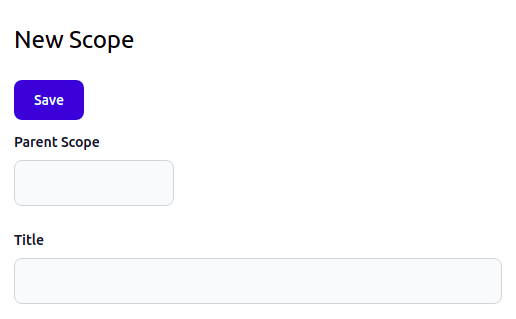

# Object Creation Form

Today, I finished implementing an object creation form. 

It works according to the specs on [Interfaces](08-data-interfaces.md) and [Forms](09-data-forms.md). Currently, it only supports string and integer input fields; later, there will be a lot more.

Let's review how it works:

{{ toc }}

### meta.abstract

Today, I finished implementing an object creation form.

It works according to the specs on *Interfaces* and *Forms*. Currently, it only supports string and integer input fields; later, there will be a lot more.

Let's review how it works.

## Configuration

All user interface details are configured directly in the data class:

    /**
     * @property ?int $parent_id #[
     *      Serialized,
     *      Table\Int_(unsigned: true, references: 'scopes.id', on_delete: 'cascade'),
     *      Form\Int_(10, 'Parent Scope'),
     * ]
     * ...
     * @property ?string $title #[
     *      Serialized,
     *      Form\String_(20, 'Title'),
     * ]
     * ...
     */
    #[Storage\Scopes, Interface_\Table\Admin('/scopes', 'Scope'), ...]
    class Scope extends Object_
    {
        use Id;
        ...
    }
    
`#[Interface_\Table\Admin]` attribute creates the user interface for editing scope objects that is accessible at `/scopes` URL. The second parameter, `Scope`, is used in various user interface labels and messages. Currently, the user interface handles two routes:

* `GET /scopes/create` route shows a form page for entering details of a new scope and saving it.
* `POST /scopes/create` route processes form data and creates a record in the underlying database table.

`#[Form\*]` attributes make `parent_id` and `title` properties to appear in the form.

## Model

The `#[Interface\]` and `#[Form\*]` attributes are reflected into the `$osm_app->schema->classes[Scope::class]->interfaces` property: 

    {
      "name": "Osm\\Admin\\Scopes\\Scope",
      "interfaces": {
        "table_admin": {
          "type": "table_admin",
          "url": "\/scopes",
          "form": {
            "chapters": {
              "": {
                "sort_order": 0,
                "name": "",
                "sections": {
                  "": {
                    "sort_order": 0,
                    "name": "",
                    "title": "General",
                    "fieldsets": {
                      "": {
                        "sort_order": 0,
                        "name": "",
                        "fields": {
                          "parent_id": {
                            "type": "int",
                            "sort_order": 10,
                            "name": "parent_id",
                            "title": "Parent Scope",
                            "template": "forms::field.int"
                          },
                          "title": {
                            "type": "string",
                            "sort_order": 20,
                            "name": "title",
                            "title": "Title",
                            "template": "forms::field.string"
                          }
                        }
                      }
                    }
                  }
                }
              }
            }
          },
          ...
        }
      },
      ...
    }
    
## Form Rendering

The `GET /scopes/create` route renders the form using its template. It passes the form definition, mode and initial form data:

    /**
     * @property \stdClass $data
     */
    #[Interface_(Admin::class), Name('GET /create')]
    class CreatePage extends Route
    {
        public function run(): Response {
            return view_response($this->form->template, [
                'form' => $this->form,
                'mode' => Form::CREATE_MODE,
                'data' => $this->data,
            ]);
        }
    
        protected function get_data(): \stdClass {
            return (object)[];
        }
    }
    
The form template, `forms::form` renders its only chapter, the chapter renders the only section, the section renders its only fieldset, and, finally, the fieldset renders the two fields, using `forms::field.int` and `forms::field.string` field templates:

## Submitting Form Data

The `Save` button, or pressing `Enter` submits the form data to the `POST /scopes/create` route via AJAX. Here is how it works.

The JavaScript `Form` controller class is attached to the `<form>` element using the `data-js-form` attribute:

    <form ... data-js-form="...">
        ...
    </form>  
    
This controller prevents default browser data submission behavior. Instead, it collects field data into a JSON manually, and sends it to the server. Once, server confirms that the scope object is created, it redirects to the object editing page using the edit form `url` received from the server:

    ...
    export default register('form', class Form extends Controller {
        get events() {
            return Object.assign({}, super.events, {
                'submit': 'onSubmit',
            });
        }
    
        onSubmit(e) {
            e.preventDefault();
    
            fetch(this.element.action, {
                method: this.element.method,
                headers: {
                    'Content-Type': 'application/json',
                },
                body: JSON.stringify(this.data),
                message: this.options.s_saving_new_object,
            })
            .then(response => {
                notice(this.options.s_new_object_saved);
    
                return response.json();
            })
            .then(json => {
                location.href = json.url;
            })
            .catch(() => null);
        }
        ...     
    });
    
## Collecting Form Data

The `Form` controller collects the form data by calling the `data()` method of every field controller:

    ...
    export default register('form', class Form extends Controller {
        ...     
        get data() {
            let data = {};
    
            this.fields.forEach(field => field.data(data));
    
            return data;
        }
    });

Field controllers are attached to the field HTML elements using `data-js-*` attributes. For example, the string field controller is attached using the `data-js-string-field` attribute:

    

        ...
    

The data method of a field controller adds the field data to the provided object:

    export default register('string-field', class String_ extends Field {
        data(data) {
            if (this.value.trim()) {
                data[this.name] = this.value.trim();
            }
        }
    
        get input_element() {
            return this.element.querySelector('input');
        }
    
        get name() {
            return this.input_element.name;
        }
    
        get value() {
            return this.input_element.value;
        }
    });

The resulting JSON containing the form data is:

    {"parent_id":1,"title":"English"}
        
## Processing Form Data 

The form data is processed by the `POST /scopes/create` route:

    #[Interface_(Admin::class), Name('POST /create')]
    class Create extends Route
    {
        public function run(): Response
        {
            $item = json_decode($this->http->content, flags: JSON_THROW_ON_ERROR);
            if (!is_object($item)) {
                return plain_response('Object expected', 500);
            }
    
            $id = query($this->class_name)->insert($item);
    
            return json_response((object)[
                'url' => $this->interface->url("/edit?id={$id}"),
            ]);
        }
    }