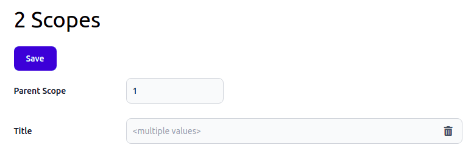
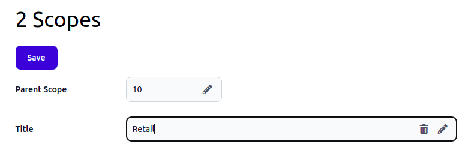
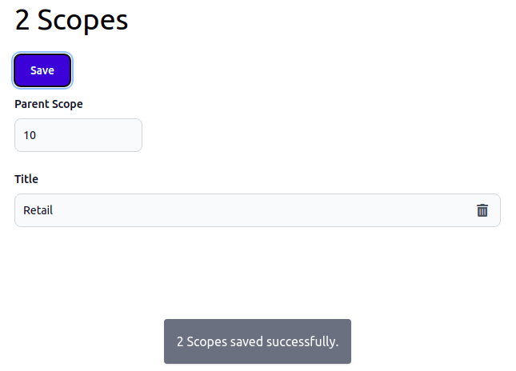

# 2021 Dec 20 - 2022 Jan 14

The last 4 weeks were mostly a vacation. It's been a time for reflection, but still, I delivered some new features.

In Osm Admin, forms already allow creating new objects and saving them to the database, and editing one or several existing objects. 

I've also implemented URL query filters that are applied to the underlying database query and that can be displayed in the user interface.

From now on, Osm Framework and all projects built with it - can be installed and developed under Apache and on Windows.

More details:

{{ toc }}

### meta.abstract

The last 4 weeks were mostly a vacation. It's been a time for reflection, but still, I delivered some new features.

In Osm Admin, forms already allow creating new objects and saving them to the database, and editing one or several existing objects. 

I've also implemented URL query filters that are applied to the underlying database query and that can be displayed in the user interface.

From now on, Osm Framework and all projects built with it - can be installed and developed under Apache and on Windows.

## I Need Your Advice

Before going into details about new features, I want to ask you something.

Currently, I'm building Osm Admin that creates database tables, the API and the admin interface for your application, and Osm Framework for building insanely extensible applications. 

My blog and Twitter are kind of "I've built this or that". It helps to create more, to be accountable and transparent, and, later, to recollect what had been done and why. All of this is fine, but it mostly benefits me rather than you.

And I really want to be useful to you guys. So, my question is - what do you want to hear from me? Please share your thoughts [here](https://twitter.com/v_osmianski/status/1481933301103448065?s=20), or [DM me on Twitter](https://twitter.com/v_osmianski).  

## Osm Admin v0.1.4

[Diff](https://github.com/osmphp/admin/compare/v0.1.3...v0.1.4)

### Filters

In the user interface, you will be able to narrow displayed data using grid column filters, or filters displayed in the sidebar. To enable that, apply `#[Filter\*]` attributes to class properties.

Applied filters appear in the URL query parameters, for example, `.../edit?id=5+16+19`, and on the page.

You can apply filters not only to a grid page, but also to a form page - to mass edit all matching objects, or to an action URL (edit, delete, or custom) - to perform the action on all matching objects.

In the same way, you can apply filters to the API URLs in order to retrieve or modify matching objects in a script.

This consistent approach to URL filters is described [here](10-data-filters.md).

### Mass-Editing

I think that it's not enough to merely be able to edit your application data, but to be very effective at that.

One important part of effective data editing is editing of multiple records in a single sit, and this part just got implemented in this release.

Here is how it works.

1. Filter objects in a grid, select one or more objects for editing and press the `Edit` button. Grids are yet to be implemented, but let's say that the edit button opens the edit form using `.../edit?id=18+19` URL. 

2. The edit form displays a field value if it's the same for all objects, or informs you that the selected objects have multiple values:

         
 
3. Change field values as needed. The edit form indicates which fields are modified, and allows you to reset the initial value:

    

4. Press the `Save` button to save the changes:

   

And that's it! Easy, right?

### Better Queries

There are two new method in the `Query` class: 

* `count()` method returns the number of objects matching currently applied filters.
* `in()` method applies `WHERE <property> IN(<values>)` filter. 

Example:

    // returns 2   
    $count = query(Scope::class)
       ->in('id', [18, 19])
       ->count(); 

## Osm Framework v0.14.9

[Diff](https://github.com/osmphp/framework/compare/v0.14.2...v0.14.9)

### Technology Stack Update

* TailwindCSS is updated to 3.0
* PHP 8.1 support
* [Apache support](https://osm.software/docs/framework/getting-started/web-server.html#apache)
* Windows support

### `js()` Helper Function

Use new `js()` helper function for passing options to JS controller in a Blade template: 

    
 'Lorem ipsum ...'])!!}'>
        ...
    

In the JS controller, all passed options are put into the `options` property:

    import Controller from "../../js/Controller";
    import {register} from '../../js/scripts';
    
    export default register('messenger', class Messenger extends Controller {
        get events() {
            return Object.assign({}, super.events, {
                'click': 'onClick',
            });
        }
    
        onClick() {
            console.log(this.options.message);        
        }
    }); 

## Osm Project v0.14.1

[Diff](https://github.com/osmphp/project/compare/v0.14.0...v0.14.1)

The project template contains new [`public/Osm_App/.htaccess`](https://github.com/osmphp/project/blob/HEAD/public/Osm_App/.htaccess) file containing Apache configuration.

For more details, check [Osm Framework documentation](https://osm.software/docs/framework/getting-started/web-server.html#apache).

## Osm Core v0.10.15

[Diff](https://github.com/osmphp/core/compare/v0.10.14...v0.10.15)

The new release contains PHP 8.1 compatibility fixes. 

## *osm.software* Website v0.4.6

[Diff](https://github.com/osmphp/osmsoftware-website/compare/v0.4.5...v0.4.6)

There is one new blog post on [Osm Admin Filters](10-data-filters.md).

And there is a fix that made me smile. After releasing the first 2022 blog post, I saw that the page design isn't tested for multiple years. How shortsighted I was!  

## To Be Continued

If you've enjoyed reading this, [follow me on Twitter](https://twitter.com/v_osmianski) and get daily updates.