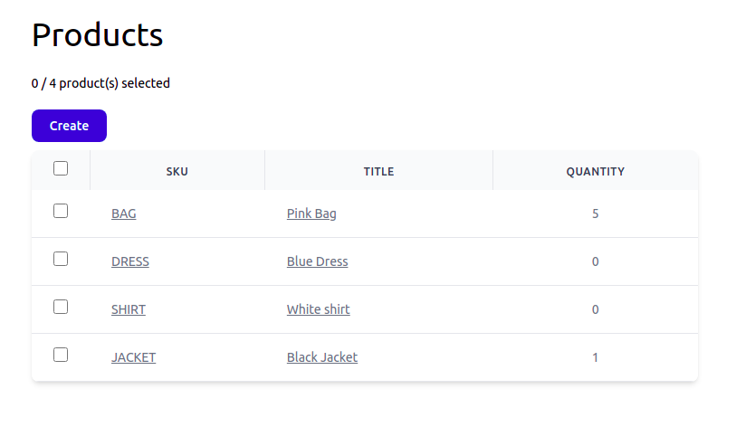
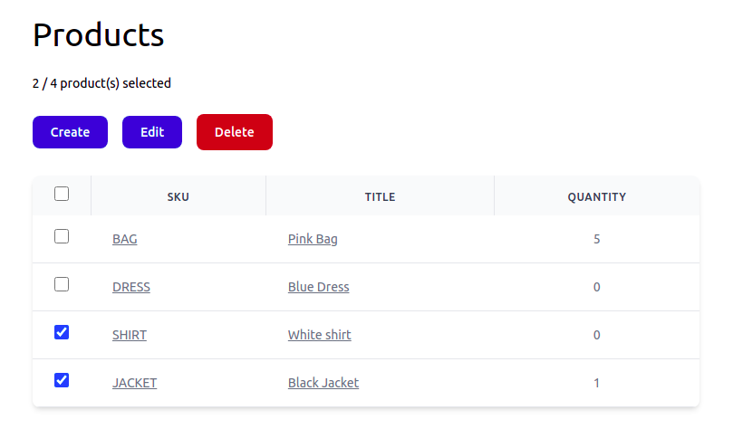
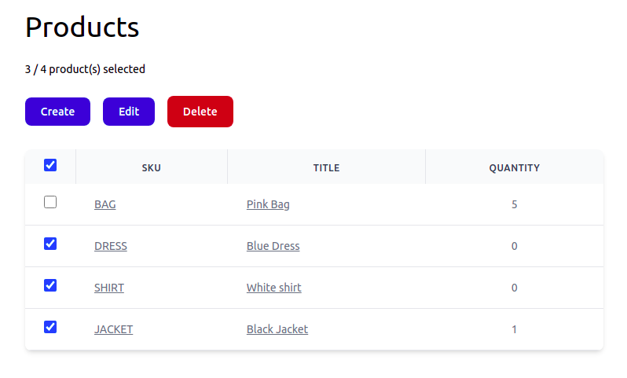
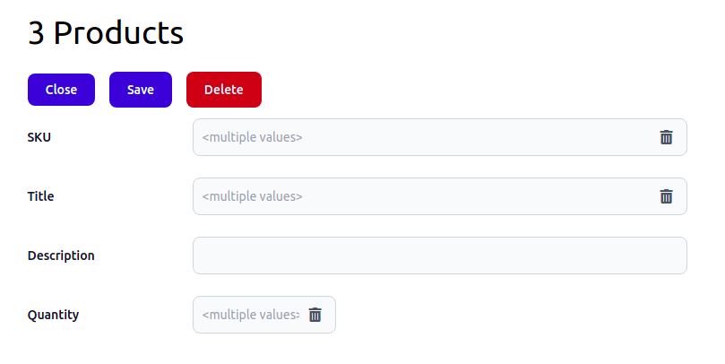
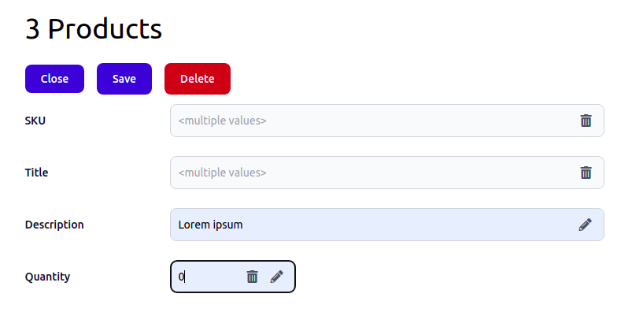
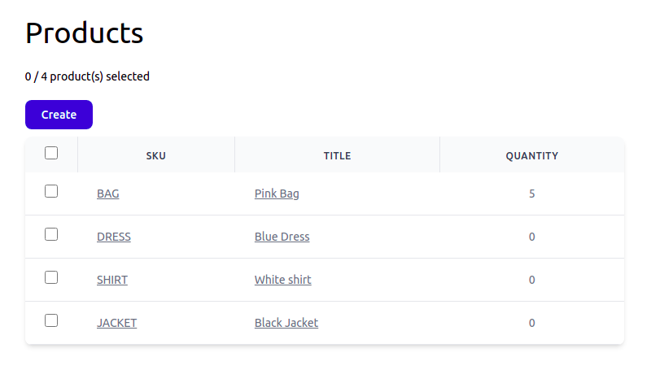

# Mass Editing

Recently, I implemented mass-editing in Osm Admin. It allows you to view and edit multiple objects in a single operation.

This article describes mass-editing from the user perspective.

Contents:

{{ toc }}

### meta.abstract

Recently, I implemented mass-editing in Osm Admin. It allows you to view and edit multiple objects in a single operation.

This article describes mass-editing of products in a typical e-commerce application.

## Usage

### Screencast

A video is worth a thousand words:

    <iframe width="560" height="315" src="https://www.youtube.com/embed/SrxXZa5SeMk" title="YouTube video player" frameborder="0" allow="accelerometer; autoplay; clipboard-write; encrypted-media; gyroscope; picture-in-picture" allowfullscreen></iframe>

### Selecting Products

Initially, products are deselected:

As in a typical CRUD application, you can create new products using the `Create` action, or edit an individual product by clicking on its SKU or title. You can also right-click product's SKU or title, and open it for editing in a new tab.

But that's not mass-editing. In order to mass-edit several products, select them:

.

Alternatively, select all products using the checkbox in the grid header, and then deselect the products you *don't want* to edit:

Either way, `Edit` and `Delete` actions appears. These actions work with the selected products.

### Editing Selected Products

After using the `Edit` action, the editing form is shown:

**Note**. You can also right-click the `Edit` button, and open selected products for editing in a new tab.

Each field shows a property value, if it's the same for all selected products. Otherwise, it shows `<multiple values>`.

Edit `Description` and `Quantity`:

  
Finally, use the `Save` action to assign new description and quantity to *all* selected products. Use `Close` action to return to the product grid, and make sure that the changes are applied:

### Field Actions

You may have noticed two icons that may appear near a field value. Let's call them field *action*:

* the *clear action* (recycle bin icon) appears if the property have different values in selected products. Click this action to clear the value in all selected products.
* the *reset action* (pen icon) indicates that the field is modified. Click this action to restore the initial value. 

### Deleting Selected Products

Use `Delete` action, either in the grid, or in the form, to delete all selected products. 

## Configuration

The best part is that you can create grid-form pairs fairly quickly and in a single file.
 
To create product properties stored in the database, grid columns and form fields for the above example, create product [`Product`](https://github.com/osmphp/admin/blob/v0.1/samples/Products/Product.php) data class as follows:

    <?php
    
    namespace ...;
    
    use ...

    /**
     * @property string $sku #[
     *      Serialized,
     *      Grid\String_('SKU', edit_link: true),
     *      Form\String_(10, 'SKU'),
     * ]
     * @property string $title #[
     *      Serialized,
     *      Grid\String_('Title', edit_link: true),
     *      Form\String_(20, 'Title'),
     * ]
     * @property ?string $description #[
     *      Serialized,
     *      Grid\String_('Description'),
     *      Form\String_(30, 'Description'),
     * ]
     * @property int $qty #[
     *      Serialized,
     *      Grid\Int_('Quantity'),
     *      Form\Int_(40, 'Quantity'),
     * ]
     */
    #[
        Storage\Table('products'),
        Interface_\Table\Admin('/products', 'Product'),
        Grid(['sku', 'title', 'qty']),
    ]
    class Product extends Object_
    {
        use Id, SubTypes;
    } 