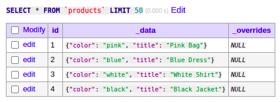

# Returning To Building In Public. Facets, Search And Indexing

Starting today, I'll write a daily blog post about how the Osm Admin development goes. 

This is the first one. It reviews where I am today, covers creation of a search index, and revisits the design of the indexing engine and how queries orchestrate the indexing. 

Details:

{{ toc }}

### meta.abstract

Starting today, I'll write a daily blog post about how the Osm Admin development goes.

This is the first one. It reviews where I am today, covers creation of a search index, and revisits the design of the indexing engine and how queries orchestrate the indexing.

## Building In Public, Again

I've been publicly silent recently, for two reasons.

The first reason is Russian war on Ukraine. It's really hard to think about anything else when it's happening so close. Well, it's really a big topic, but this website is not about it. In short, I `#StandWithUkraine`.

The second reason is a decision I made three weeks ago. I noticed that it's hard constantly switch back and forth between the developer mode (building something), and the normal mode (telling about it).

And I decided to build for the whole week, then write about it on Friday, and then share it in chunks the whole next week.

Needless to say, the plan didn't work. The two lessons I've learned from this experiment:

1. The best moment to share something is when you are experiencing it.
2. Public accountability is good for your productivity.

Now, I'm returning to building in public.

## Daily Status Updates

Starting today, I'll write a daily blog post about how the Osm Admin development goes. There will be no entry if a day is dedicated to other things.

You know, I already write some ideas, take design decisions, and write notes to future self. Previously, it's been a directory of Markdown files on my computer, now, it's inside Trello cards.

The idea is to take these notes, polish them a bit, and publish as blog posts. 

Earlier, I posted status updates every two weeks, the daily blog posts are kind of replacement that comes out way more frequently.

Let's see how it all works out.

## Where I Am Now

Osm Admin is about:

* defining application data structure using regular PHP classes
* generating database tables for storing instances of these classes
* managing them in the application admin area using automatically generated user interface.

### Sample Class

I have a sample class:

    /**
     * @property string $color #[Option(Color::class), Faceted]
     */
    class Product extends Record
    {
    }

It's based on the `Record` class:

    /**
     * @property int $id #[Explicit, Unsigned, AutoIncrement, Hidden, Facet\Id]
     * @property ?string $title
     */
    class Record extends Object_
    {  
    }

As you see, product objects have 3 properties: `id`, `title` and `color`. Later, there will be more.

### Database

The following CLI commands create `products` table, and fill it in with sample data:

    php bin/run.php migrate:schema
    php bin/run.php migrate:samples
    
Here is a screenshot of it (I use [Adminer](https://www.adminer.org/)):

### List Page

Osm Admin automatically creates `GET /products/` route that displays product list page. At the moment, the page is under development and throws an exception, but it had already rendered a (simplistic) grid.

The default grid layout shows a single property - `title`. However, in a separate class, I created a custom grid layout for product objects showing `title` and `color` properties:

    #[Class_(Product::class), View('list')]
    class Grid extends BaseGrid
    {
        protected function get_selects(): array
        {
            return ['title', 'color'];
        }
    }

### Specifications And Comments
 
You may wonder about the meaning of attributes used in the sample code. There may be other things that are project-specific.

I really hope that you'll eventually catch up.

One thing that may help is [Specifications](https://osm.software/docs/admin/0.2/specifications.html).

This section is not a final documentation of how things work. Instead, it specifies how things *should* work, what is already implemented and what is left to do. I put some effort to keep this section up-to-date.

Another thing that may help is code comments. I started this project without writing code comments at all, but now it's changing.   

## Search Index

Currently, I'm adding a faceted navigation to the sidebar of the product list page, similar to one you see in this blog.

By the way, that's why the product list page doesn't work - I added faceted navigation there, and it's throwing `NotImplemented` exception here and there.

I've been building faceted navigation solutions for 10 years, and I've learned it hard way that eventually you'll need full-text search, too, and that full-text search + faceted navigation are best solved using ElasticSearch or similar software (I'll refer to it as *search*).

To use search, I have to build the search index, that is, create it and fill it in with data.

`migrate:schema` CLI command eventually calls [`Table::create()`](https://github.com/osmphp/admin/blob/v0.2/src/Schema/Table.php) method that creates database table. Let's add search index creation there:

    $this->search->create($this->table_name, function(SearchBlueprint $index) {
        foreach ($this->properties as $property) {
            if ($property->index) {
                $property->createIndex($index);
            }
        }
    });

`$property->index` returns true if the property should be added to the search index:

    protected function get_index(): bool {
        return $this->index_filterable || $this->index_sortable != null ||
            $this->index_searchable != null;
    }

`index_*` properties specify settings and behavior related to if and how a property is filtered, sorted, searched, and faceted.

## `Property::$index_filterable`

As I'm currently building faceted navigation, let's consider when a property can be faceted.

`Product::$color` attribute is added to the faceted navigation using the [`#[Faceted]`](https://github.com/osmphp/admin/blob/v0.2/src/Ui/Attributes/Faceted.php) attribute, and it should be added to the search index as follows:

    $index->string('color')
        ->filterable()
        ->faceted();

What about other `Product` properties? 

In the future, every grid column will have a popup menu with filter and sorting options similar to a typical spreadsheet application. 

Currently, the product `Grid`(https://github.com/osmphp/admin/blob/v0.2/samples/Products/Product/Grid.php) has `title` and `color` columns. Both are filterable, but:

* `title` column menu will contain a text search filter input, and facet counting for it is not needed.
* `color` column menu will show options and facet counts, and it will need the underlying facet in the search index.

Both are `string` properties. `color` property that needs a facet index can be distinguished by the [`#[Option]`](https://github.com/osmphp/admin/blob/v0.2/src/Schema/Attributes/Option.php) attribute.

Grid can also display virtual properties (computed upon request), and more complex formulas. Such columns won't allow filtering them.

Summing up, a property should be marked as filterable in the search index if it's `#[Faceted]` or shown in a grid. In addition, a filterable property may be faceted in the search index. For example, a `string` property is faceted if it's marked with the `#[Option]` attribute.

## Search Index Creation Works!

    > curl 'localhost:9200/admin2_products/_mapping?pretty'
    {
      "admin2_products" : {
        "mappings" : {
          "properties" : {
            "color" : {
              "type" : "keyword"
            },
            "id" : {
              "type" : "integer"
            },
            "title" : {
              "type" : "keyword"
            }
          }
        }
      }
    }

As you see, `filterable()`, `faceted()` doesn't matter that much in ElasticSearch. However, they matter in Algolia, I'll test it later.

## Indexing

The next task is to fill in the search index with data, and keep it updated.

In `v0.1` of Osm Admin, I've already implemented [indexing](https://osm.software/blog/21/11/data-indexing-2.html) - data flow within the same table and across tables. It isn't migrated to `v0.2` yet, and it's a good moment to review it.

There are five indexing use cases:

1. *Regular indexing*. The main use case is that an object property is computed from properties in the related tables. The computation is done asynchronously.
2. *Self indexing*. An object property is computed from other properties in the same table. The computation happens before INSERT/UPDATE.
3. *ID-based indexing*. An object property is computed from object's ID. The computation happens after INSERT, but before UPDATE.
4. *Search indexing*. An object property is added to the search index asynchronously.
5. *Aggregation indexing*. An aggregated property value is computed from the detail tables asynchronously.

Right now, I'm only interested in the search indexing. Some design decisions are applicable to other indexing use cases, but I'll return to them later.

## Full Reindexing

For maximum performance, indexing should be executed only if required, that is if there are changes in the source data that can affect target data.

And should be reliable as otherwise, it would be really frustrating experience. Two measures to take are:

* Unit test all possible data changes, and resulting indexing operations.
* If necessary, re-index a given table, or all tables from scratch.

The syntax could be:

    // re-index all tables
    $schema->reindex();

## Asynchronous Indexing

Regular indexing, search indexing and aggregation indexing are executed asynchronously. It means that during INSERT/UPDATE/DELETE operation, Osm Admin remembers ID of the affected source object in the *notification tables*, but doesn't modify any target object.

Based on property formulas and other settings, the `Query` knows what notifications to create if certain properties change.

Changes in explicit properties can be tracked using database triggers.

Then, a separate process runs that processes records in the notification tables, updates target objects, and clears processed notification records.

The syntax could be:

    // process pending notifications in all tables
    $schema->index();

## Synchronous Indexing

When INSERT/UPDATE happens, it processes all pending notifications for the updated object.

## Indexing In `Query`

Indexing is partly initiated, and partly executed in `Query`.

For example, `Query->update()` code can look like the following:

    public function update(array $data): void {
        // all input data is validated before running a transaction
        $this->validateProperties(static::UPDATING, $data);

        $this->db->transaction(function() use($data) {
            // register a callback that is executed before 
            // committing the transaction
            $this->db->committed(function ()
            {
                // validate modified objects as a whole, and their 
                // dependent objects
                $this->validateObjects(static::UPDATED);

                // create notification records for the dependent objects in 
                // other tables, and for search index entries
                $this->notifyDependentObjects($data);
            });

            // register a callback that is executed after a successful transaction
            $this->db->committed(function ()
            {
                // successful transaction guarantees that current objects are 
                // fully up-to-date (except aggregations), so it's a good time to
                //make sure that asyncronous indexing is queued, or to execute
                // it right away if queue is not configured. All types of asynchronous
                // indexing are queued/executed: regular, aggregation and search.
                $this->updateDependentObjects();
            });

            // regular, self and ID-based indexing expressions are added 
            // to the UPDATE statement. Note that property-level validation 
            // rules on computed values are not executed - take care in formulas
            $this->computeProperties(static::UPDATING, $data);

            // generate and execute SQL UPDATE statement
            $bindings = [];
            $sql = $this->generateUpdate($data, $bindings);
            $this->db->connection->update($sql, $bindings);
        });
    }

## All Computed Properties Must Be Nullable

During INSERT, a record is created, and then an additional UPDATE runs that assigns computed properties. Between INSERT and UPDATE all computed properties are `NULL`.

## `$db->committing()` And Other Transaction Events

Handle DB transaction events by attaching a callback using one of the following methods:

* `committing()` - your code will be executed before committing the outer transaction.
* `committed()` - your code will be executed after committing the outer transaction.
* `rolledBack()` - your code will be executed after rolling back the outer transaction.