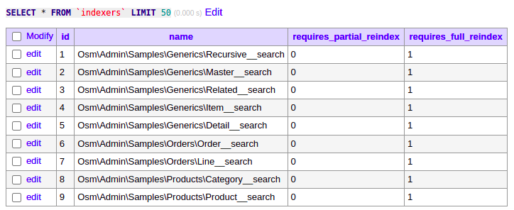

# Full Search Reindexing

Today I finished indexing design, described typical indexing logic, implemented full search reindexing.

Here is how it went:
 
{{ toc }}

### meta.abstract

Today I finished indexing design, described typical indexing logic, implemented full search reindexing.

## Merging `index()` And `reindex()`

First, re-indexing is similar to indexing, and one method is better than two:

    // full re-indexing
    $schema->index(full: true);

    // incremental/asynchronous indexing
    $schema->index();

## `Schema::index()`

It's likely that data changes are going to be infrequent, and that all of them can be processed in one go in reasonable amount of time. Hence, `index()` is going to process the changes in one go.

Indexing should be done in *waves*. First, regular indexing, then aggregate indexing, and finally, search indexing. However, in code, indexers are just executed one after another. It's a matter of sorting indexers appropriately.

    public function index(bool $full = false): void {
        foreach ($this->indexers as $indexer) {
            $indexer->index($full);
        }
    }

## `Indexer::index()`

While you can define an indexer that create, updates or deletes records in the target table in any way you want, some indexers have a standard behavior.

### Regular Indexer

A regular indexer computes properties from the properties stored in the related tables.

For example:

    /**
     * @property ?Category $category #[...]
     * @property string $category_title #[Computed('category.title ?? NULL')]
     */
    class Product extends Record {
    }

The indexer updates existing objects in a table using:

    UPDATE ... JOIN ... SET ... WHERE ...

In a flat table, such as `orders`, it updates all the records in one go.

In a hierarchical table, such as `categories`, it goes level-by-level: first, it updates top-level categories, then second-level categories, and so on.

### Indexer-Owner

An indexer-owner creates an object in the target table for every object in the source table matching a certain criteria. For example, objects in `url_keys` table are created/updated based on objects in `products` table:

    /**
     * @property ?Product $product #[..., OnDeleteCascade, Computed('id')]
     * @property string $url_key #[Computed('URL_KEY('title')')]
     */
    #[Class_(UrlKey::class)]
    class UrlKey\ProductIndexer extends Indexer\Owner {
        protected function get_query() {
            return query(Product::class);
        }
    }

The indexer creates/updates objects in a table from the main source table using:

    INSERT INTO ... SELECT ... FROM ... JOIN ... ON DUPLICATE KEY UPDATE ...

### Aggregate Indexer

An aggregate indexer updates properting by summing, counting or otherwise aggregating properties in the related tables.

For example:

    /**
     * @property StockItem[] $stock_items #[...]
     * @property string $qty #[Aggregate('SUM(stock_items.qty)')]
     */
    class Product extends Record {
    }

The indexer updates existing objects in a table using:

    UPDATE ... JOIN ... SET ... WHERE ... GROUP BY ...

In most cases, it updates all the records in one go.

In a hierarchical table, such as `categories`, if aggregation is based on child objects of the same table, it goes level-by-level: first, it updates the grand-children, then children, and so on.

### Search Indexer

Finally (and that's the current focus), A search indexer replicates INSERT/UPDATE/DELETE operations, one by one, by SELECTing changes objects and applying changes to the search index. It runs:

    SELECT ... JOIN ... WHERE ...

## Indexer Status

Indexers are a part of the schema. However, their status is stored in the `indexers` table:

    uid
    requires_partial_reindex
    requires_full_reindex

The `Schema::index()` method should take into account these flags:

    public function index(bool $mode = self::FULL_REINDEX): void {
        $status = $this->getIndexingStatus();

        foreach ($this->indexers as $indexer) {
            if ($indexerMode = $indexer->requiresReindex($status, $mode)) {
                $indexer->index($status, $indexerMode);
            }
        }
    }

The `$status` of all indexes are fetched in the beginning, and each indexer invalidates `$status` of indexes dependent on it.

## Collecting Indexers

Osm Admin collects indexers from `Table::$indexers` which currently only provides the search indexer:

    protected function get_indexers(): array {
        return [
            'search' => Indexer\Search::new(),
        ];
    }

It assigns unique indexer names. For the search indexer, the *short name* is `search`:

    protected function get_name(): string {
        return "{$this->table_name}__{$this->short_name}";
    }

Then it sorts collected indexers using `Indexer::$after_regexes`. The search indexer is executed after all regular and aggregate indexers:

    protected function get_after_regexes(): array {
        return ['/__regular$/', '/__aggregate__$/'];
    }

## Creating Indexer Status Records

Serialized `Indexer::$id` property create a status record for the indexer:

    protected function get_id(): int {
        $id = $this->db->table('indexers')
            ->where('name', $this->name)
            ->value('id');

        return $id ?? $this->db->table('indexers')->insertGetId([
            'name' => $this->name,
        ]);
    }

And here is how it looks:

## `osm index`

Use `osm index` command to re-index pending changes (*partial* mode), and use `osm index -f` flag to force full reindexing of all the indexers (*full* mode).

I'll start implementing full reindexing first, and partial reindexing later.

`osm index` command calls `Schema::index(Indexer::FULL)`:

    /**
     * In `PARTIAL` mode, processes all pending change notifications
     * for all tables. In `FULL` mode, calculates all indexes on all
     * tables anew.
     * 
     * @param string $mode `Indexer::PARTIAL` or `Indexer::FULL`
     */
    public function index(string $mode = Indexer::PARTIAL): void {
        $status = $this->getIndexerStatus();

        foreach ($this->indexers as $indexer) {
            if ($indexerMode = $indexer->requiresReindex($status, $mode)) {
                $indexer->index($status, $indexerMode);
            }
        }
    }

## Retrieving Indexer Statuses

`Schema::getIndexerStatus()` retrieves indexer statuses from the `indexers` table:

    /**
     * @return IndexerStatus[]
     */
    protected function getIndexerStatus(): array {
        return $this->db->table('indexers')
            ->get(['id', 'requires_partial_reindex', 'requires_full_reindex'])
            ->keyBy('id')
            ->toArray();
    }

Here, `IndexerStatus` is a hint class - actual array items are plain PHP objects, but for better code completion, they "appear" to IDE as `IndexerStatus` objects:

    /**
     * @property int $id
     * @property bool $requires_partial_reindex
     * @property bool $requires_full_reindex
     */
    class IndexerStatus
    {
    }

## Not Every Indexer Has To Run

`Indexer::requiresReindex()` decides whether the indexer has to run (non-null) value, and if so, should it run in `PARTIAL` or `FULL` mode:

    /**
     * @param IndexerStatus[] $status
     * @param string $mode
     * @return ?string
     */
    public function requiresReindex(array $status, string $mode): ?string {
        if ($mode == static::FULL) {
            return static::FULL;
        }

        if ($status[$this->id]->requires_full_reindex) {
            return static::FULL;
        }

        return $status[$this->id]->requires_partial_reindex
            ? static::PARTIAL
            : null;
    }

## Updating The Search Index

What is left is to write the search index in the `Indexer\Search::index()` method:

    /**
     * @param IndexerStatus[] $status
     * @param string $mode
     */
    public function index(array &$status, string $mode): void {
        throw new NotImplemented($this);
    }

Let's start with the mode check - I'm not going to implement the partial mode right now:

    public function index(array &$status, string $mode): void {
        if ($mode = static::FULL) {
            $this->fullReindex();
        }
        
        throw new NotImplemented($this);
    }

The `fullReindex()` method has to wipe out all contents from the search index, and pump all the contents into it anew.

## Clearing The Search Index

I'm not proud of the following, but I'll make it better later:

    protected function fullReindex(): void {
        // TODO: use an API that clears all index entries with one call -
        // there should be one!
        foreach ($this->search->index($this->table->table_name)->ids() as $id) {
            $this->search->index($this->table->table_name)->delete($id);
        }

        throw new NotImplemented($this);
    }

Note that I notoriously keep throwing an exception if something is not implemented yet. Nothing is worse than your software not doing stuff just because you've forgotten to implement it!

## Filling In The Search Index

Another piece that will eventually get better. The logic, however, is trivial - take indexed properties and put them into the database:

    protected function fullReindex(): void {
        ...
        // TODO: implement and use `chunk()` method, and insert in bulks
        foreach ($this->query()->get() as $item) {
            $this->searchQuery()->insert((array)$item);
        }
    }

    protected function query(): Query {
        $query = query($this->table->name)
            ->select('id');

        foreach ($this->table->properties as $property) {
            if ($property->index) {
                $query->select($property->name);
            }
        }

        return $query;
    }

## Marking Indexer As Indexed

Finally, let's mark the indexer as "indexed" - that there are no pending changes, both in the `indexers` table, and in the `$status` array.

Things may change while Osm Admin deals with the search engine, so it's better to run the whole indexed code in DB transaction:

    // class Schema 
    public function index(string $mode = Indexer::PARTIAL): void {
        $status = $this->getIndexerStatus();

        foreach ($this->indexers as $indexer) {
            if ($indexerMode = $indexer->requiresReindex($status, $mode)) {
                $this->db->transaction(function()
                    use($indexer, &$status, $indexerMode)
                {
                    $indexer->index($indexerMode);
                    $indexer->markAsIndexed($status);
                });

            }
        }
    }

    // class Indexer
    /**
     * @param IndexerStatus[] $status
     */
    public function markAsIndexed(array &$status): void {
        $status[$this->id]->requires_partial_reindex = false;
        $status[$this->id]->requires_full_reindex = false;

        $this->db->table('indexers')
            ->where('id', $this->id)
            ->update([
                'requires_partial_reindex' => false,
                'requires_full_reindex' => false,
            ]);
    }

## Does It Work?

Let's see:

    # create DB tables and fill them in with sample data
    php bin/run.php migrate:schema && php bin/run.php migrate:samples

    # run indexers
    php bin/run.php index

    # dump ElasticSearch index into a file
    curl -XPOST 'localhost:9200/admin2_products/_search?pretty' \
        -H "Content-Type: application/json" \
        -d '{"query": { "match_all": {} }}' > ~/es_data.json

And yes, it does! 