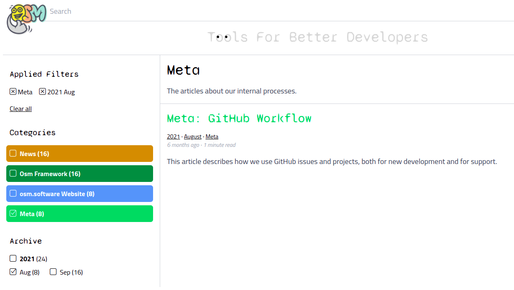

# Search Hit Limit Must Be Explicit 

## Wrong Facet Counts In The Blog

Ironically, now when I'm implementing the faceted navigation in Osm Admin, I've noticed that the faceted navigation in my own blog is not working as expected. In the following example: 1 blog post, and then count shows "8":

What's going on?

Let's check [what's inside the ElasticSearch index](https://gist.github.com/osmianski/225bc158c910be534d7ddcfc582685c6).

It turns out, a given blog post was added to the index 8 times. In `osm.software` blog, I update the index with either `osm index:blog` or `osm index:blog -f` commands ([Osm Admin uses the same approach](https://osm.software/blog/22/03/data-full-search-reindexing.html#osm-index)). `-f` option clears the index, and add all entries anew:

        foreach ($this->search->index('posts')->ids() as $id) {
            $this->search->index('posts')->delete($id);
        }

And here is a problem. By default, if not entry limit is specified, ElasticSearch returns only the first 10 entries. So the `osm index -f` doesn't delete all records, but just the first 10 ones!

For now, let's just add the big enough `limit()` call:

        $ids = $this->search->index('posts')->limit(10000)->ids();

        foreach ($ids as $id) {
            $this->search->index('posts')->delete($id);
        }

## Fixing Implicit Search Limit In Osm Framework

The implicit ElasticSearch hit limit is confusing. And you can't get all the hits - there is 10000 maximum hit limit that you can't exceed even explicitly.

Let's throw an exception if some other code tries to retrieve search index data without setting the limit:

    // ElasticSearch/Query.php
    protected function paginateElasticQuery(array $request): array {
        ...
        if ($this->limit !== null) {
            $request['body']['size'] = $this->limit;
        }
        else {
            throw new InvalidQuery(__("Call 'limit()' before retrieving data from the search index"));
        }
        ...
    }

### meta.abstract

The implicit ElasticSearch hit limit is confusing. And you can't get all the hits - there is 10000 maximum hit limit that you can't exceed anyway.

Be explicit about the maximum number of search hits.