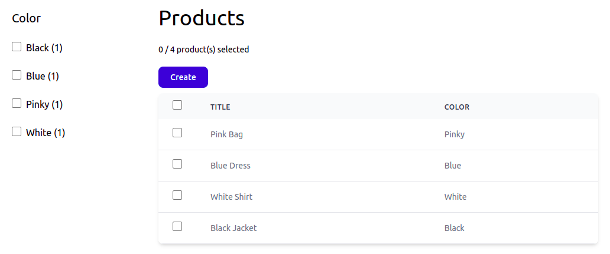

# Rendering Facets And Applying Filters

Three days ago, I [started rendering faceted navigation](https://osm.software/blog/22/03/data-current-goal-data-combining-elasticsearch-and-mysql-rendering-faceted-navigation.html#drawing-color-facet-template), and namely, `color` facet on the product list page.

Yesterday, I continued working on it and got the first render of the faceted navigation, defined URL action syntax, and the first facet filter applied on the product list page.

Continue reading:

{{ toc }}

### meta.abstract

Three days ago, I *started rendering faceted navigation*, and namely, `color` facet on the product list page.

Yesterday, I continued working on it and got the first render of the faceted navigation, defined URL action syntax, and the first facet filter applied on the product list page.

## Populating `color` Facet Data

My first idea was to retrieve facets counts from the search index, and then render them in the template. However, it's not a good idea.

For each facet option, the search index returns its value (e.g. `red`), and the number of matching products, e.g. (1). UI needs much more than that:

* option title - `Red`
* full URL with applied filter - `.../products/?color=red`
* a flag indicating whether the option is currently applied
* additional data for JS behavior, telling to add `color=red` to the URL dynamically if user clicks the option.

Populating the additional data should only be done once. For example, if the `color` facet options are rendered both in the sidebar and in the `color` column popup menu, Osm Admin should spent time generating URL twice.

For this reason, the additional data should be populated by `Ui\Query`, not by `Facet\Checkboxes` view.

Note that HTTP API will also use the same `Ui\Query` to retrieve product data and facets, and it may not need all the populated data. For this reason, I'll use `#[Serialized]` attribute to mark what data is returned through the API.

Some tinkering ... and here is the first result:

## Generating Filtered URL

Every facet option is a link to the list page with applied filter. The URL is generated as follows:

    // Osm\Admin\Ui\Query\Facet\Option
    protected function get_url(): string {
        return $this->query->toUrl('GET /', $this->action);
    }

    protected function get_action(): string {
        return "+{$this->property_name}={$this->value}";
    }

However, the `Query::toUrl()` method doesn't do anything meaningful. Let's fix that.

## Action Syntax

Generating URL from the current URL by adding or removing a parameter is a very common task in faceted navigation. Let's implement that.

Let's call the "adding or removing a parameter" an *action*. An action can be written using PHP object syntax that is used internally (create objects using `Action::...` helper methods), and short string syntax that is convenient to pass over the wire:

    /**
     * Removes all filters from the URL.
     *
     * String syntax: '-'
     *
     * @return \stdClass|static
     */
    public static function removeFilters(): \stdClass|static {
        return (object)[
            'type' => static::REMOVE_ALL_FILTERS,
        ];
    }

    /**
     * Removes specified parameter from the URL.
     *
     * String syntax: '-color'
     *
     * @param string $param
     * @return \stdClass|static
     */
    public static function removeParameter(string $param): \stdClass|static {
        return (object)[
            'type' => static::REMOVE_PARAMETER,
            'param' => $param,
        ];
    }

    /**
     * Removes specified multi-value filter option from the URL.
     *
     * String syntax: '-color=red'
     *
     * @param string $param
     * @param string $value
     * @return \stdClass|static
     */
    public static function removeOption(string $param, string $value)
        : \stdClass|static
    {
        return (object)[
            'type' => static::REMOVE_OPTION,
            'param' => $param,
            'value' => $value,
        ];
    }

    /**
     * Removes specified multi-value filter option from the URL.
     *
     * String syntax: 'color=red'
     *
     * @param string $param
     * @param string $value
     * @return \stdClass|static
     */
    public static function setParameter(string $param, string $value = null)
        : \stdClass|static
    {
        return (object)[
            'type' => static::SET_PARAMETER,
            'param' => $param,
            'value' => $value,
        ];
    }

    /**
     * Removes specified multi-value filter option from the URL.
     *
     * String syntax: '+color=red'
     *
     * @param string $param
     * @param string $value
     * @return \stdClass|static
     */
    public static function addOption(string $param, string $value)
        : \stdClass|static
    {
        return (object)[
            'type' => static::ADD_OPTION,
            'param' => $param,
            'value' => $value,
        ];
    }

In string syntax, values are URL-encoded. Several actions are combined using `&`, for example:

    +color=red&-offset&-limit

Convert action objects to string using `UrlAction::toString()` helper method:

    $actionUrl = UrlAction::toString([
        UrlAction::addOption('color', 'red'),
        UrlAction::removeParameter('offset'),
        UrlAction::removeParameter('limit'),
    ]);
    
## Back To Filtered URL

URL action syntax changes how the facet `Option` generates its URL:

    protected function get_url(): string {
        return $this->query->toUrl('GET /', $this->actions);
    }

    protected function get_actions(): array {
        return [
            UrlAction::addOption($this->property_name, $this->value),
        ];
    }

    protected function get_action_url(): string {
        return UrlAction::toString($this->actions);
    }

Let's implement `Query::toUrl()` method. Currently, `Query` doesn't parse incoming request parameters yet, so it starts applying actions to an empty array `$this->url`:

    /**
     * Generates URL based on the current query parameters, and requested
     * `$actions`. 
     *
     * @param string $routeName
     * @param UrlAction[] $actions
     * @return string
     */
    public function toUrl(string $routeName, array $actions)
        : string
    {
        $url = $this->table->url($routeName);

        $parameters = $this->url;

        foreach ($actions as $action) {
            switch ($action->type) {
                case UrlAction::REMOVE_ALL_FILTERS:
                    foreach (array_keys($parameters) as $param) {
                        if (isset($this->table->properties[$param])) {
                            unset($parameters['param']);
                        }
                    }
                    break;
                case UrlAction::REMOVE_PARAMETER:
                    unset($parameters[$action->param]);
                    break;
                case UrlAction::REMOVE_OPTION:
                    if (isset($parameters[$action->param]) &&
                        ($index = array_search($action->value,
                            $parameters[$action->param])) !== false)
                    {
                        array_splice($parameters[$action->param],
                            $index, 1);

                        if (empty($parameters[$action->param])) {
                            unset($parameters[$action->param]);
                        }
                    }
                    break;
                case UrlAction::SET_PARAMETER:
                    $parameters[$action->param] = $action->value !== null
                        ? [$action->value]
                        : null;
                    break;
                case UrlAction::ADD_OPTION:
                    if (!isset($parameters[$action->param])) {
                        $parameters[$action->param] = [];
                    }
                    $parameters[$action->param][] = $action->value;
                    break;
            }
        }

        $parameterUrl = '';
        foreach ($parameters as $param => $values) {
            if ($parameterUrl) {
                $parameterUrl .= '&';
            }

            $parameterUrl .= $param . ($values !== null
                ? '=' . implode('+', array_map(
                    fn($value) => url_encode($value),
                    $values
                ))
                : '');
        }

        return $parameterUrl ? "{$url}?{$parameterUrl}" : $url;
    }

Much better! 

The URL are generated, for example:

    http://admin2.local/admin/products/?color=black

## Parsing HTTP Parameters
    
The next step is to process applied filters, and other query parameters as specified in the current HTTP request. The controller passes the HTTP query to `Ui\Query::fromUrl()` method, and this method doesn't do anything:

    /**
     * Parse HTTP query parameters except `$ignored` ones. It includes:
     * * filter parameters starting with the filtered property name, for
     *      example, `color=red blue&price=5-100&id-=1 2 3`.
     * * `all` - operate without any filters. If there is any filter parameter,
     *      `all` parameter is ignored
     * * `limit` - limit returned object count
     * * `offset` - returns objects starting from Nth
     * * `order` - one or more orders, ` ` (encoded as `+`) meaning ascending order,
     *      and `-` meaning descending order, for example, `order=color-price`.
     *      Either way, `-id` order is implicitly added.
     * * `q` - search specified phrase
     * * `select` - requested select formulas delimited by ` ` (encoded as `+`).
     *      Non-identifier formulas should go in parentheses with mandatory
     *      alias, for example, `select=title color (qty > 0 AS in_stock)`.
     *
     * @param array $query URL query parameters in shallow-parsed format, usually
     *      taken from `$osm_app->http->query`.
     * @param string ...$ignored Ignored parameters, for example,
     *      `'all', 'select', 'id', 'id-'`.
     * @return $this
     */
    public function fromUrl(array $query, string ...$ignored): static {
        throw new NotImplemented($this);
    }

Leaving reserved parameters, such as `offset` or `limit` aside, it calls `parseUrlFilter()`:

    public function fromUrl(array $query, string ...$ignored): static {
        foreach ($query as $key => $value) {
            if (in_array($key, $ignored)) {
                continue;
            }
            
            switch ($key) {
                case 'all':
                case 'limit':
                case 'offset':
                case 'order':
                case 'q':
                case 'select':
                    throw new NotImplemented($this);
                default:
                    $this->parseUrlFilter($key, $value);
                    break;
            }
        }
        
        return $this;
    }

Long story short, the filter is applied:

However, there are things to fix:

1. Applied facet option is not checked.
2. Applied facet option URL should remove it from filter.
3. Facet should show all options, not just the selected one.

To be continued. 

