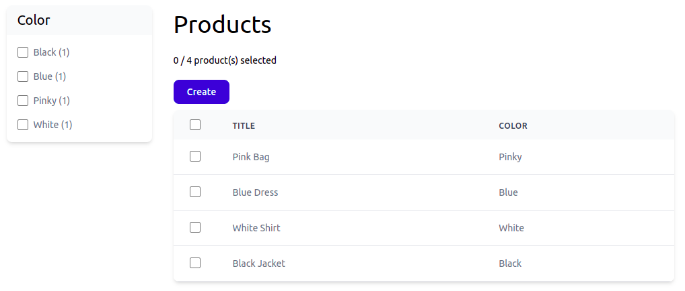

# `Option` And `Faceted` Attribute Combo Works!

Yesterday, I polished the product `color` facet, and, starting now, you can create a facet with a list of string options very quickly, just by marking a property as `#[Faceted]`:

    /**
     * @property string $color #[Option(Color::class), Faceted]
     */
    class Product extends Record
    {

Here is how it went:

{{ toc }}

### meta.abstract

Yesterday, I polished the product `color` facet, and, starting now, you can create a facet with a list of string options very quickly, just by marking a property as `#[Faceted]`.

    /**
     * @property string $color #[Option(Color::class), Faceted]
     */
    class Product extends Record
    {

## Facet Should Show All Options, Not Just The Applied One

Currently, I apply a facet option and request facet counts in the same ElasticSearch query. Just think about it - of course, it's counts only the applied option!

Instead, I should get counts for an applied facet in a separate search query that doesn't apply that facet.

Here is the current logic:

    protected function runSearchAndDb(): Result {
        $searchQuery = $this->searchQuery();

        $facets = array_unique($this->facets);
        foreach ($facets as $propertyName) {
            $this->table->properties[$propertyName]->facet->query($searchQuery);
        }

        foreach ($this->filters as $filter) {
            $filter->querySearch($searchQuery);
        }

        $searchResult = $searchQuery
            ->count()
            ->limit(10000)
            ->get();

        ...
    }
  
First, let's exclude applied facets from this code:

    ...
    $facets = array_unique($this->facets);
    foreach ($facets as $propertyName) {
        if (isset($this->filters[$propertyName])) {
            continue;
        }

        $this->table->properties[$propertyName]->facet->query($searchQuery);
    }
    ...
    
Then, let's count each applied facet with a =n additional search query:

    ...
    foreach ($facets as $propertyName) {
        if (!isset($this->filters[$propertyName])) {
            continue;
        }

        $searchQuery = $this->searchQuery()->hits(false);
        $this->table->properties[$propertyName]->facet->query($searchQuery);

        foreach ($this->filters as $filteredPropertyName => $filter) {
            if ($filteredPropertyName !== $propertyName) {
                $filter->querySearch($searchQuery);
            }
        }

        $searchResult = $searchQuery->get();

        $result->facets[$propertyName] =
            $this->table->properties[$propertyName]->facet
                ->populate($this, $searchResult);
    }

    return $result;
 
The method body is too long, I know. However, it's likely to be far from the final version, and I'm leaving it as-is for now.

## A Bit Of CSS 

I made the look of the faceted navigation more consistent with the grid:

## Show Applied Facet Option As Checked

In the Blade template, I added:

    ...
    <input type="checkbox"
        ...
        @if ($option->applied) checked @endif
        >
    ...

`applied` is computed when populating facet options for each retrieved count:

    // Osm\Admin\Ui\Facet\Checkboxes
    
    protected function populateOption(Query $query, Count|\stdClass $option)
        : Option
    {
        return Option::new([
            ...
            'applied' => $this->populateApplied($query, $option),
        ]);
    }
    
    protected function populateApplied(Query $query, Count|\stdClass $option)
        : bool
    {
        if (!($filter = $query->filters[$this->property->name] ?? null)) {
            return false;
        }

        return $filter->isOptionApplied($option);
    }

    // Osm\Admin\Ui\Filter\In_
    
    public function isOptionApplied(Count|\stdClass $option): bool {
        return in_array($option->value, $this->items);
    }

## Applied Facet Option URL Should Remove It From Filter

I changed `Option::$url` computation logic as follows:

    // Osm\Admin\Ui\Query\Facet\Option
    
    protected function get_url(): string {
        return $this->query->toUrl('GET /', $this->actions);
    }

    protected function get_actions(): array {
        return $this->applied
            ? [
                UrlAction::removeOption($this->property_name, $this->value),
            ]
            : [
                UrlAction::addOption($this->property_name, $this->value),
            ];
    }

## Adding Facet Option JS Behavior

Currently, if you click on a checkbox, it becomes checked, but the filter is not applied. If you click on a link, the filter is applied, but while page is being loaded, the checkbox is not checked.

To fix that, let's add JS controller to each facet option to handle that:

    // themes/_admin__tailwind/views/ui/facet/checkboxes.blade.php
    ...
    @foreach ($options as $option)
        <li class="p-2 my -mx-2" data-js-facet-checkbox>
            ...
        </li>
    @endforeach
    ...         
    
At this point, console should complain about unregistered `facet-checkbox` JS controller, but it doesn't. Fixed it by restarting `gulp && gulp watch` command that is always running in background.

Let's define an empty JS controller:

    // themes/_admin__tailwind/js/ui/Controllers/Facet/Checkbox.js

    import Controller from "../../../js/Controller";
    import {register} from '../../../js/scripts';
    
    export default register('facet-checkbox', class Checkbox extends Controller {
    });
    
    // themes/_admin__tailwind/js/ui/scripts.js
    
    ...
    import './Controllers/Facet/Checkbox';
    
Yep, the console warning is gone, controller instances are attached to the facet options!

Now let's handle DOM events in each facet option:

    // themes/_admin__tailwind/js/ui/Controllers/Facet/Checkbox.js

    export default register('facet-checkbox', class Checkbox extends Controller {
        get events() {
            return Object.assign({}, super.events, {
                // event selector
                'click input': 'onCheckboxClick',
                'click a': 'onLinkClick',
            });
        }
    
        get link_element() {
            return this.element.querySelector('a');
        }
    
        get checkbox_element() {
            return this.element.querySelector('input');
        }
    
        onCheckboxClick(e) {
            location.href = this.link_element.href;
            e.stopPropagation();
        }
    
        onLinkClick() {
            this.checkbox_element.checked = !this.checkbox_element.checked;
        }
    });
    
Much better!

## In Front Area, Canonical URL Is Needed

A note to my future self :)

If `/products/?color=red+blue` and `/products/?color=blue+red` render the same page, specify which one should be shown on the SERP (search engine result page) using canonical URL meta tag.  

In the canonical URL, render query parameters (and multiple values in the same parameter) in the same order.  

Alternatively, redirect user to the page with ordered query parameters.

It's not relevant for admin area, but the same queries will be used in the front area, so please take care of it then.  

## Applied Filters

I want an additional sidebar block telling me what filters are applied:

* For `color` filters, it will show option titles, e.g. `Black`.
* If search is involved, it will show the search phrase.
* Each filter will have a button to remove the filter.
* There will be a button to remove all filters.

The editing page will also show the faceted navigation and applied filters, however, I'm not so sure how it should work there.

I'll return to this part later, when the editing form works.