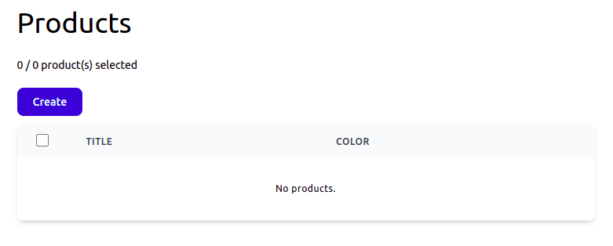

# Notification Tables

[Yesterday](28-data-post-create-db-only-queries-on-editing-page-change-notifications.md), indexers started listening to query `inserted`, `updated` and `deleted` notifications and creating records in notification tables.

Now, saving a product complains:

    Table 'admin2.zi9__products__inserts' doesn't exist

Fair enough. Let's create it.

{{ toc }}

### meta.abstract

*Yesterday*, indexers started listening to query `inserted`, `updated` and `deleted` notifications and creating records in notification tables.

Now, saving a product complains:

    Table 'admin2.zi9__products__inserts' doesn't exist

Fair enough. Let's create it.

## Creating Notification Tables

**Q**. When Should It Be Created?

A notification table should be created *after* creating the main table - `products`, as I'd want to `CASCADE DELETE` a product insert notification if the product is deleted.

A notification table should be created after creating the indexer status record, as the indexer ID is used in the notification table name.

To sum up, it should be created when the source notification table is created.

It seems that altering database schema after class schema changes seems to be an important and interesting task. I'll devote the next iteration to solving this challenge. Till then, I'll recreate the database after any class schema change.

In the `Table` class, I added notification table creation:

    public function create(): void
    {
        ...
        foreach ($this->listeners as $listener) {
            $listener->createNotificationTables($this);
        }
    }

The `Indexer` class does the heavy-lifting:

    public function createNotificationTables(Table $source): void  {
        $listensTo = $this->listens_to[$source->name];

        if ($inserted = $listensTo[Query::INSERTED] ?? null) {
            $this->createNotificationTable($source, $inserted, cascade: true);
        }

        if (($updated = $listensTo[Query::UPDATED] ?? null) &&
            $updated != $inserted)
        {
            $this->createNotificationTable($source, $updated, cascade: true);
        }

        if ($deleted = $listensTo[Query::DELETED] ?? null) {
            $this->createNotificationTable($source, $deleted, cascade: true);
        }
    }

    protected function createNotificationTable(Table $source, string $suffix,
        bool $cascade = false): void
    {
        $this->db->create($this->getNotificationTableName($source, $suffix),
            function(Blueprint $table) use ($source, $cascade) {
                $table->integer('id')->unsigned()->unique();

                if ($cascade) {
                    $table->foreign('id')
                        ->references('id')
                        ->on($source->table_name)
                        ->onDelete('cascade');
                }
            }
        );
    }

I marked the `id` column as `unique()`. It won't work well with updates, as multiple updates may happen in the same object until it's processed by the indexer. I'll handle that later.

## Segmentation Fault During `migrate:schema`     

While running `osm migrate:schema` console command, I get:

    Segmentation fault (core dumped)
    
It's very frustrating. The only way to debug this kind of error is setting breakpoints here and there and eventually find out the line that causes the error.

The problem was in search index creation. `id` field is added there anyway, and `id` property tried to add `id` field one more time. So I added a check for that:

    public function create(): void
    {
        ...
        $this->search->create($this->table_name, function(SearchBlueprint $index) {
            foreach ($this->properties as $property) {
                if ($property->name === 'id') {
                    continue;
                }
                ...
            }
        });
        ...
    }
 
## Notification Table Names

I changed notification table naming as follows:

    protected function getNotificationTableName(Table $table, string $suffix)
        : string
    {
        return "zi{$this->id}__{$table->table_name}__{$suffix}";
    }

This way, notification tables will appear after all "normal" tables in the database administration tool (I use [Adminer](https://www.adminer.org/)). 

## Styling Empty Grid

While indexing doesn't work, I've noticed that the product grid is ugly when empty, so I styled it a bit:  

  